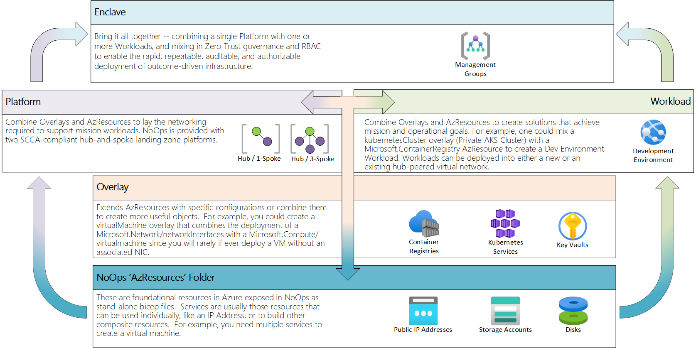

# Azure NoOps Accelerator

> **"NoOps automates platform administration and broaden communication between developers, cyber, and operations to achieve mission success**."

**Azure NoOps Accelerator** is a flexible foundation that enables US Department of Defense and other Public Sector customers to quickly develop and maintain opinionated, policy-driven, and self-service enclaves in their Azure environments.

Delivered as a collection of infrastructure as code (IaC) module templates written and maintained in [Bicep](https://github.com/Azure/NoOpsAccelerator/tree/main/src/bicep) and [Tereform](https://github.com/Azure/NoOpsAccelerator/tree/main/src/terraform), the NoOps Accelerator is intended to empower organizations on their journey towards a continuous deployment and governance model for their cloud infrastructure.

Learn more about the NoOps movement and philosophy here - *[What is NoOps?](https://github.com/Azure/NoOpsAccelerator/tree/main/docs/What-is-NoOps.md)*.

## Goals and Non-Goals of the Azure NoOps Accelerator Project

### Goals

* Designed for US Government mission customers, with a specific focus on the US Department of Defense, Military Departments and coalition partners.
* Provide reusable and composable IaC modules that hyper-automate infrastructure deployment using Microsoft best practices.
* Simplify compliance management through automated audit, reporting, and remediation.
* Deliver example [Platform modules](./src/bicep/platforms/) that implement SCCA controls and follow [Microsoft's SACA implementation guidance](https://aka.ms/saca).
* Support deployment to Azure Commercial, Azure Government, Azure Government Secret, and Azure Government Top Secret clouds.
* Accelerate the US Government's use of Azure by easing the onboarding of mission workloads, spanning mission applications, data, artificial intelligence, and machine learning.

### Non-Goals

* The NoOps Accelerator cannot automate the approval for Authority to Operate (ATO) or equivalent compliance, governance and authorisation process, though it will enable Customers to collect, customize, and submit for ATO based on their departmental requirements.
* The NoOps Accelerator will not strive for 100% compliance on all deployed Azure Policies for reference implementations. Customers must review [Microsoft Defender for Cloud Regulatory Compliance dashboard](https://ms.portal.azure.com/#view/Microsoft_Azure_Security/SecurityMenuBlade/~/22) and apply appropriate exemptions.

## Getting Started

Definitions of NoOps primitives.

### Architecture

| Primitive | Definition |
| :---------------| :--------- |
| **AzResources** | Wrap [Azure Resource Providers](https://docs.microsoft.com/en-us/azure/azure-resource-manager/management/azure-services-resource-providers) so that they understand how to fit and work together. The most basic building blocks in NoOps. |
| **Overlays** | Extend *AzResources* with specific configurations or combine them to create more useful objects.<BR/><BR/>For example, the `kubernetesCluster` overlay could be used to deploy a Private AKS Cluster rather than using the `Microsoft.ContainerService/managedClusters` AzResource to deploy a vanilla AKS cluster.<BR/><BR/>Similarly, a `virtualMachine` overlay could be created that combines the deployment of a `Microsoft.Network/networkInterfaces` with a `Microsoft.Compute/virtualmachine` since you will rarely if ever deploy a VM without an associated NIC. |
| **Platforms** | Combine *Overlays* and *AzResources* to lay the networking required to support mission workloads. NoOps is provided with three SCCA-compliant hub-and-spoke landing zone platforms. The [Quickstart](#quickstart) above walks through the deployment of a SCCA-compliant hub-and-3-spoke platform.
| **Workloads** | Combine *Overlays* and *AzResources* to create solutions that achieve mission and operational goals. For example, a `kubernetesCluster` overlay (Private AKS Cluster) could be combined with a `Microsoft.ContainerRegistry` AzResource to create a **Dev Environment** workload.<BR/><BR/>Workloads can be deployed into either a new or an existing hub-peered virtual network.|
| **Enclaves** | Bring it all together -- combining a single *Platform* with one or more *Workloads*, mixing in Zero Trust governance and RBAC to enable the rapid, repeatable, auditable, and authorizable deployment of outcome-driven infrastructure. |

<!-- markdownlint-disable MD033 -->
<!-- allow html for images so that they can be sized -->

<!-- markdownlint-enable MD033 -->

### Telemetry

Microsoft can identify the deployments of the Azure Resource Manager and Bicep templates with the deployed Azure resources. Microsoft can correlate these resources used to support the deployments. Microsoft collects this information to provide the best experiences with their products and to operate their business.  The telemetry is collected through [customer usage attribution](https://docs.microsoft.com/azure/marketplace/azure-partner-customer-usage-attribution). The data is collected and governed by Microsoft's privacy policies, located at [https://www.microsoft.com/trustcenter](https://www.microsoft.com/trustcenter).

If you don't wish to send usage data to Microsoft, you can set the `customerUsageAttribution.enabled` setting to `false` in `global/telemetry.json`.

Project Bicep [collects telemetry in some scenarios](https://github.com/Azure/bicep/blob/main/README.md#telemetry) as part of improving the product.

## Quickstart Deployment - BICEP

While the NoOps Accelerator can be used to build all sorts of useful solutions, a simple place to start is deploying a workload platform.
You can use the NoOps Accelerator to deploy [SCCA-compliant landing zones](./src/bicep/platforms/) based on Microsoft's [SACA implementation guidance][saca] and [Mission Landing Zone][mlz] architecture.

### Deploy a SCCA-compliant Landing Zone (SCCA Hub with 3 Spokes) using the Azure CLI

These steps walk through how to use NoOps to deploy a [hub and spoke](https://learn.microsoft.com/en-us/azure/architecture/reference-architectures/hybrid-networking/hub-spoke) architecture. At the conclusion, you will have five resource groups mapped to the following:

* Hub: SCCA-compliant networking hub (1 vnet, 1 resource group)
* Tier 0 (T0): Identity & Authorization (1 vnet, 1 resource group)
* Tier 1 (T1): Infrastructure Operations, and Logging (1 vnet, 2 resource groups)
* Tier 2 (T2): DevSecOps & Shared Services (1 vnet, 1 resource group)

### Prerequisites

To continue with the quick start you will need the following as a minimum. 

* Git client
* Visual Studio Code (or alternative IDE of choice)
* Azure CLI
* Azure Bicep version 0.11.1 (030248df55) or later

A detailed and complete list of prerequisites is documented in the [wiki](https://github.com/Azure/NoOpsAccelerator/blob/main/docs/wiki/Deploying-NoOps-Accelerator-Pre-requisites.md).

> **Note**: Don't have these? Try [Azure Cloud Shell](https://docs.microsoft.com/en-us/azure/cloud-shell/overview) in your browser as an alternative.

#### Steps

1. Clone this repository and change directory to the `/src/bicep/platforms/lz-platform-scca-hub-3spoke` directory

    ```plaintext
    git clone https://github.com/Azure/NoOpsAccelerator.git
    cd /src/bicep/platforms/lz-platform-scca-hub-3spoke
    ```

1. Connect to your Azure Account and check the current context is for the subscription, tenant and environment you are deploying to and make changes where necessary.

    ``` bash
    az login
    az account show
    ```

1. Open the `/src/bicep/platforms/lz-platform-scca-hub-3spoke/parameters/deploy.parameters.json` file and replace the following parameters:
    * `"subscriptionId": "<<subscriptionId>>"` with your SubscriptionId. Ensure all instances of this parameter are changed in this file.
    
    > **Note**: Multiple subscriptions may be configured (*i.e.*, to have separate subscriptions for each 'tier' in the MLZ architecture) in the `parameters/deploy.parameters.json` but a single subscription is used for this quickstart.

1. For the quickstart, a deployment into the current subscription can be completed using the following parameters and the `az sub create command`:

    * `--name`: (optional) The deployment name, which is visible in the Azure Portal under Subscription/Deployments.
    * `--location`: (required) The Azure region to store the deployment metadata.
    * `--template-file`: (required) The file path to the `deploy.bicep` template.
    * `--parameters`: (required for quickstart) The file path to the `parameters/deploy.parameters.json` file

    Here is an example that deploys the hub and spoke architecture into a single subscription and a chosen region of Azure Commercial:

    ```bash
    # Replace with the Azure region you want to deploy to.
    location="<<your region>>"

    az deployment sub create \
        --name deploy-noops-quickstart \
        --location $location \
        --template-file deploy.bicep \
        --parameters @parameters/deploy.parameters.json
    ```

#### Next Steps

1. After a successful deployment, take a look at the **[enclaves](./src/bicep/enclaves/)** folder for examples of complete, outcome-driven solutions built using the NoOps Accelerator. Also, be sure to take a look through our **[workloads](./src/bicep/workloads)** and **[overlays](./src/bicep/overlays)** folders explore how you can expand the **platform** you just deployed and solve your mission challenges.

1. Further example platform deployments and tutorials are available in the **[training](./docs/training/)** folder.

> **Note**: Don't forget to **clean-up your environment** by removing all of the resource groups locks and deleting the resource groups created by the deployment when you are done with this Quickstart.

## Contributing

This project welcomes contributions and suggestions.  Most contributions require you to agree to a
Contributor License Agreement (CLA) declaring that you have the right to, and actually do, grant us
the rights to use your contribution. For details, visit <https://cla.opensource.microsoft.com>.

When you submit a pull request, a CLA bot will automatically determine whether you need to provide
a CLA and decorate the PR appropriately (e.g., status check, comment). Simply follow the instructions
provided by the bot. You will only need to do this once across all repos using our CLA.

This project has adopted the [Microsoft Open Source Code of Conduct](https://opensource.microsoft.com/codeofconduct/).
For more information see the [Code of Conduct FAQ](https://opensource.microsoft.com/codeofconduct/faq/) or
contact [opencode@microsoft.com](mailto:opencode@microsoft.com) with any additional questions or comments.

## Feedback, Support, and How to Contact Us

Please see the [WIKI](https://github.com/Azure/NoOpsAccelerator/tree/main/docs/wiki) for guidance on how to support the Azure NoOps Accelerator, provide feedback or report issues.

## Trademarks

This project may contain trademarks or logos for projects, products, or services. Authorized use of Microsoft trademarks or logos is subject to and must follow
[Microsoft's Trademark & Brand Guidelines](https://www.microsoft.com/en-us/legal/intellectualproperty/trademarks/usage/general).
Use of Microsoft trademarks or logos in modified versions of this project must not cause confusion or imply Microsoft sponsorship.
Any use of third-party trademarks or logos are subject to those third-party's policies.

## Special Thanks and Liner Notes

This project is greatly influenced by and owes a debt of gratitude to the following:

* [Common Azure Resource Modules Library](aka.ms/carml)
* [Azure Landing Zones for Canadian Public Sector](https://github.com/azure/canadapubsecalz)
* [Mission Landing Zone][mlz]

[//]: # (************************)
[//]: # (INSERT LINK LABELS BELOW)
[//]: # (************************)

[mlz]:  https://github.com/Azure/missionlz "Mission Landing Zone GitHub Repo"
[saca]: https://aka.ms/saca "Microsoft Secure Azure Computing Architecture (SACA) Guidance"
