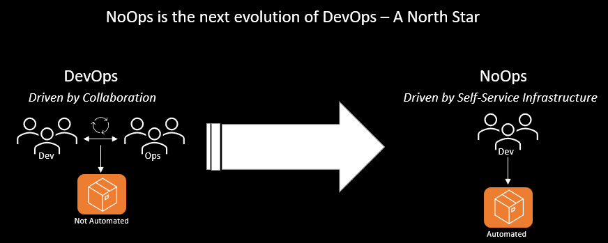

# What is NoOps? - Shift IT’s focus from Operations to Mission Outcomes

First and foremost, The goal of NoOps is to drive mission success with an outcome-based approach to deliver continuous value to enable the warfighter.

The term "NoOps" in our context came from a special mission unit customer that was looking for the ease of deployment with Mission Landing Zone (MLZ) plus valuable workloads with greater flexibility and needed to have lower O&M due to a small staff size. They requested the ability to “hyper-automate” their Azure footprint and Governance to allow for what they called “NoOps.”

NoOps stands for “no operations” but it is not that. In our mindset, It is the belief that software environments can be automated to a point where manual handoffs and low-value, rote administration can be eliminated. NoOps helps increase the abstraction of infrastructure, tightly integrated with DevOps workflows, that requires no operations team to oversee the process.

Instead, Teams can use a set of tools and services to responsibly deploy the required cloud components in a secure manner, including both the code and infrastructure. The delivery is crucial in a mission team, this is why we need to orchestrate the whole process. We must think beyond technical delivery in order to execute NoOps and get to the point where the benefits flow to the warfighter.

NoOps in a nutshell: create smart infrastructure with as little maintenance effort as possible and automate everything.

## Requirements for Successful NoOps Environment

The creator of the Azure NoOps Accelerator, John Spinella coins NoOps as **"NoOps is a policy-based, automated process to enable organizations to deploy, monitor, and improve cloud operations."**

John looks at NoOps as the next evolution of DevOps. DevOps being the fusion of development and operations engineers collaborating together,NoOps main aim is to automate all the platform management parts and reduce friction between developers and infrastructure. 

DevOps moves into NoOps – where automation and the cloud allows developers to deploy without the need to understand the infrastructure. The purpose of NoOps is to define a process where there is no need to combine the part of the development with the operation to make things work. Making everything automatically deployable by design is the aim of NoOps. A NoOps technique basically involves the developer committing the code to the repository and then automating the deployment process. Although it may appear to be like continuous delivery, there is more to it. When we use the term "deployment" in this context, we also refer to the infrastructure.

### DevOps Mindset

Driving the DevOps mindset will prepare your team to handle collaboration, change control and the continuous deployment. Much of this is common to your developers but maybe new to cyber & operations. To customize and manage an Azure environment will need to have Cyber, Operations, and Development personnel work together to build the “workload blocks” and compose and maintain the Enclave code for their environment. This is an opportunity to improve every customers’ DevOps practices and gain these efficiencies.

### Roles & Skillsets

Roles & Skillsets are critical to success with NoOps. These teams work in close collaboration with the SME functions across the organization:

- AppOps (Development): capable with modern DevOps practices & tools such as source control (Git), & Continuous Integration/Delivery (CI/CD)

    > In some cases, Development and Platform Teams can share duties

- PlatformOps: Responsible for management and deployment of control plane resource types such as subscriptions, management groups via IaC and the respective CI/CD pipelines. Management of the platform related identify identity resources on Azure AD and cost management for the platform.

     > Operationalization of the Platform for an organization is under the responsibility of the platform function.

- CyberOps: Responsible for definition and management of Azure Policy and RBAC permissions on the platform for landing zones and platform management groups and subscriptions. Security operations including monitoring and the definition and the operation of reporting and auditing dashboard.

- NetOps: Definition and management of the common networking components in Azure including the hybrid connectivity and firewall resource to control internet facing networking traffic. NetOps team is responsible to handout virtual networks to landing zone owners or team.

### Shared Responsibility Model

Even though development, platform, cyber & operations team members have specific roles and responsibilities, it is the collaboration between these four groups that will make NoOps successful.

### Leadership Support

Policy-driven governance is a core tenet of NoOps that requires direct leadership input. Many operations organizations do not have development staff which is necessary for NoOps success therefore leadership should be aware of the potential staffing gap.

Implementing NoOps principles will help you focus on your business and customers, rather than your infrastructure. IT and how they measure the delivery speed of new services and applications to meet changing business requirements.

## The Road to NoOps

NoOps and DevOps essentially try to achieve the same thing: improve the software deployment process and reduce time to the warfighter. But while the collaboration between developers and operations team was emphasized in DevOps, the focus has shifted to complete automation in NoOps.

### More automation, smaller teams

NoOps shifts the focus to cloud services that are deployable by design without manual intervention. From infrastructure to management activities, the aim is to control everything using code, meaning every component should be deployed as part of the code and maintainable in the long run. NoOps essentially seeks to eliminate the manpower required to support the cloud ecosystem for workloads.

### Shift from operations to mission results

NoOps also shifts the focus from operations to mission outcomes. Unlike DevOps, where the dev team and ops team work together to deliver value propositions to the customer, NoOps ideally eliminates any dependency on the operations team, which further reduces time to get to the warfighter. Again, the focus is shifted to priority tasks that deliver value to warfighters—in other words, “fast beats slow.”

## Destination NoOps

DevOps is considered more of a journey, not a destination, where the focus is on continuous improvement. It would be safer to say that NoOps is the evolution of DevOps, targeting a perfect end-state of extreme automation. It allows organizations to redirect time, effort, and resources from operations to mission outcomes.

Like DevOps, NoOps is more about the shift in culture and process, rather than technology. Organizations need to be intentional about this shift while staying grounded as to the practicalities of the transition.

Learn how the [Azure NoOps Accelerator](blank.md) can help your team achieve NoOps.
