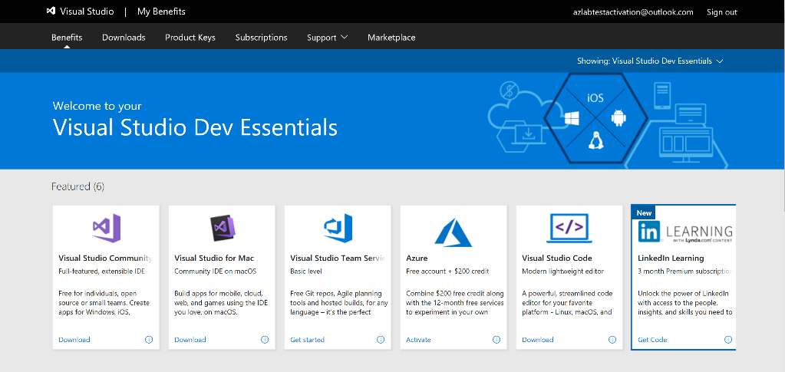
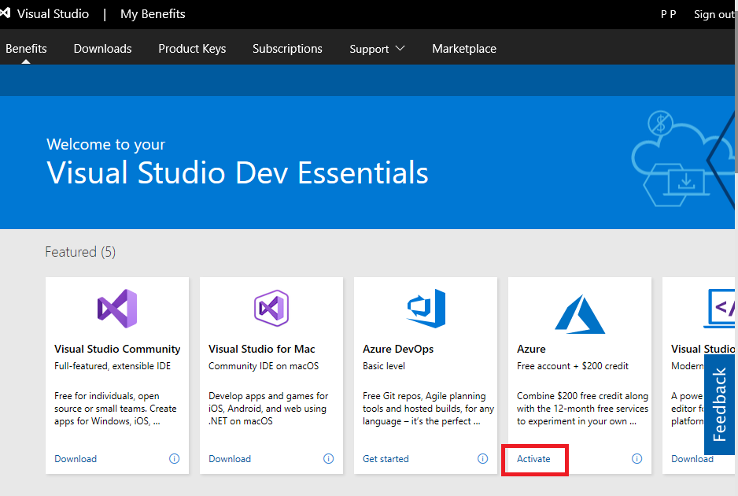

# NoOps Accelerator Labs
## Module: NoOps - Lab - Sign Up for Free Azure Subscription
### Lab Manual
**Conditions and Terms of Use**  

The contents of this package are for informational and training purposes only and are provided "as is" without warranty of any kind, whether express or implied, including but not limited to the implied warranties of merchantability, fitness for a particular purpose, and non-infringement.

Training package content, including URLs and other Internet Web site references, is subject to change without notice. Because Microsoft must respond to changing market conditions, the content should not be interpreted to be a commitment on the part of Microsoft, and Microsoft cannot guarantee the accuracy of any information presented after the date of publication. Unless otherwise noted, the companies, organizations, products, domain names, e-mail addresses, logos, people, places, and events depicted herein are fictitious, and no association with any real company, organization, product, domain name, e-mail address, logo, person, place, or event is intended or should be inferred.

**Copyright and Trademarks**

© Microsoft Corporation. All rights reserved.

Microsoft may have patents, patent applications, trademarks, copyrights, or other intellectual property rights covering subject matter in this document. Except as expressly provided in written license agreement from Microsoft, the furnishing of this document does not give you any license to these patents, trademarks, copyrights, or other intellectual property.

Complying with all applicable copyright laws is the responsibility of the user. Without limiting the rights under copyright, no part of this document may be reproduced, stored in or introduced into a retrieval system, or transmitted in any form or by any means (electronic, mechanical, photocopying, recording, or otherwise), or for any purpose, without the express written permission of Microsoft Corporation.

For more information, see **Use of Microsoft Copyrighted Content** at [https://www.microsoft.com/en-us/legal/copyright/permissions](https://www.microsoft.com/en-us/legal/copyright/permissions)

Microsoft®, Internet Explorer®, and Windows® are either registered trademarks or trademarks of Microsoft Corporation in the United States and/or other countries. Other Microsoft products mentioned herein may be either registered trademarks or trademarks of Microsoft Corporation in the United States and/or other countries. All other trademarks are property of their respective owners.

 

## Contents
[**Introduction**](#introduction)  
[**Objectives**](#objectives)  
[**Prerequisites**](#prerequisites)  
[**Scenario**](#scenario)  
[**Exercise 1: Sign Up for Free Azure Subscription**](#exercise-1-enable-your-azure-subscription-msdn-or-other-microsoft-program)  
[Task 1: Enable your Azure Subscription](#task-1-enable-your-azure-subscription)  

## Introduction ##

In this lab, you will enable your Microsoft Azure subscription benefits because we need an environment to run the lab. 

### Objectives ###

After completing this lab, you will be able to:

- Request a temporary Azure subscription for test purposes.  

- Create an Azure Subscription

### Prerequisites ###

- You need a Microsoft account with MSDN benefits or a subscription through your Enterprise agreement  

**Estimated Time to Complete This Lab**  
15 minutes

### Scenario ###

As a MSDN subscriber, you want to enable your Azure subscription to build a development virtual machine, host Visual Studio, and synchronize it with Visual Studio Online.  

## Exercise 1: Enable your Azure Subscription (MSDN or other Microsoft program) ##

### Objectives ###

In this exercise, you will:

- Enable your MSDN Azure benefits.
- Connect to the Azure portal

### Task 1: Enable your Azure Subscription ###

1. First, go to your Visual Studio subscription page: 

   https://www.visualstudio.com/subscriptions/ 

   

2. From there, click **Sign in** (at the top right corner). If you do not have an MSDN account, follow the process to create one.

3. You will arrive at this page. On this page, click use your benefits.

   

4. Accept Visual Studio Dev Essentials EULA (End User License Agreement) by clicking on **Confirm** to avail the benefits.

   

5. On the next page, you will be able to see a list of benefits titled **Visual Studio Dev Essentials**.  

   

6. In that list, there is an **Azure** tab with a free $200 credit towards your account. Click the Activate as per the following screen shot:  

   

7. You will be prompted to enter the credentials for your Microsoft account (email).

8. Next, you will need to fill the **Mobile verification** section:

   * Enter your mobile number, and click the **Send text Message** button.

   * You should receive a verification code through text on your mobile phone.

   * Enter the verification code that was sent in a text message to you into the form and click the **Verify code** button.

     

   

9. Next, you will be asked to enter credit card information. This information will not be used unless you switch to a paid offering.

   

10. Finally, select the check box in the **Agreement** section, and then click the **Sign up** button.

    

11. From there, you will be redirected to the Microsoft Azure Portal ([portal.azure.com](https://manage.windowsazure.com/)). You can either take the tour or jump right in and start deploying applications in the cloud and configuring your various Azure services.

    

12. Congratulations, you have created a new Azure subscription.

    