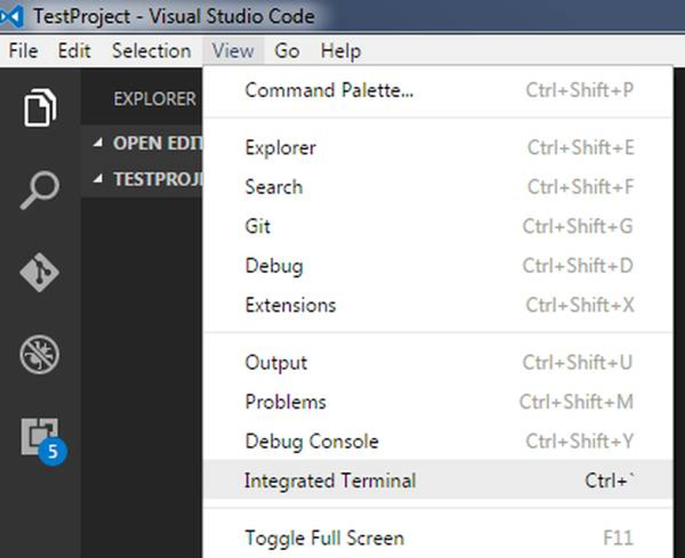

# NoOps Accelerator Labs
## Module: NoOps - Lab - Creating NoOps Lab Environment
### Lab Manual
**Conditions and Terms of Use**  

The contents of this package are for informational and training purposes only and are provided "as is" without warranty of any kind, whether express or implied, including but not limited to the implied warranties of merchantability, fitness for a particular purpose, and non-infringement.

Training package content, including URLs and other Internet Web site references, is subject to change without notice. Because Microsoft must respond to changing market conditions, the content should not be interpreted to be a commitment on the part of Microsoft, and Microsoft cannot guarantee the accuracy of any information presented after the date of publication. Unless otherwise noted, the companies, organizations, products, domain names, e-mail addresses, logos, people, places, and events depicted herein are fictitious, and no association with any real company, organization, product, domain name, e-mail address, logo, person, place, or event is intended or should be inferred.

**Copyright and Trademarks**

© Microsoft Corporation. All rights reserved.

Microsoft may have patents, patent applications, trademarks, copyrights, or other intellectual property rights covering subject matter in this document. Except as expressly provided in written license agreement from Microsoft, the furnishing of this document does not give you any license to these patents, trademarks, copyrights, or other intellectual property.

Complying with all applicable copyright laws is the responsibility of the user. Without limiting the rights under copyright, no part of this document may be reproduced, stored in or introduced into a retrieval system, or transmitted in any form or by any means (electronic, mechanical, photocopying, recording, or otherwise), or for any purpose, without the express written permission of Microsoft Corporation.

For more information, see **Use of Microsoft Copyrighted Content** at [https://www.microsoft.com/en-us/legal/copyright/permissions](https://www.microsoft.com/en-us/legal/copyright/permissions)

Microsoft®, Internet Explorer®, and Windows® are either registered trademarks or trademarks of Microsoft Corporation in the United States and/or other countries. Other Microsoft products mentioned herein may be either registered trademarks or trademarks of Microsoft Corporation in the United States and/or other countries. All other trademarks are property of their respective owners.

</br>

## Contents
[**Introduction**](#introduction)  
[**Prerequisites**](#prerequisites)  
[**Exercise 1: Configuring the lab environment**](#exercise-1-configuring-the-lab-environment)  
[Task 1: Configuring Visual Studio Code](#task-1-configuring-visual-studio-code)  


<div style="page-break-after: always;"></div>

<a name="Introduction"></a>

## Introduction ##

This document outlines the required steps to setup NoOps Accelerator, we will utilize in the following labs.

In this lab, you will learn how to establish a local Git repository, which can easily be synchronized with a centralized Git repository in GitHub for the NoOps Accelerator.

<a name="Prerequisites"></a>
### Prerequisites ###

- [Visual Studio Code](https://code.visualstudio.com/) with the [C#](https://marketplace.visualstudio.com/items?itemName=ms-dotnettools.csharp) extension installed.

- [Git for Windows](https://gitforwindows.org/) 2.33.0 or later.

- This lab requires you to complete the End to End Prerequisite instructions.

**Estimated Time to Complete This Lab**  
60 minutes

<div style="page-break-after: always;"></div>

<a name="Exercise1"></a>
## Exercise 1: Configuring the lab environment ##

<a name="Ex1Task1"></a>
### Task 1: Configuring Visual Studio Code ###

1. Open **Visual Studio Code**. In this task, you will configure a Git credential helper to securely store the Git credentials used to communicate with Azure DevOps. If you have already configured a credential helper and Git identity, you can skip to the next task.

1. From the main menu, select **Terminal \| New Integrated Terminal** to open a terminal window.



2. Execute the command below to configure a credential helper.

    ```
    git config --global credential.helper wincred
    ```
3. The commands below will configure your user name and email for Git commits. Replace the parameters with your preferred user name and email and execute them.

    ```
    git config --global user.name "John Doe"
    git config --global user.email johndoe@example.com
    ```

<a name="Exercise2"></a>
## Exercise 2: Cloning the NoOps Accelerator repository ##

<a name="Ex2Task1"></a>
### Task 1: Cloning NoOps Accelerator repository with Intergated Terminal ###

1. In a browser tab, navigate to the NoOps Accelerator git repo at [http://aka.ms/azurenoops](http://aka.ms/azurenoops).

1. Getting a local copy of a Git repo is called "cloning". Every mainstream development tool supports this and will be able to connect to GitHub to pull down the latest source to work with. Navigate to the **Code** menu.

    

1. From the HTTPS tab, Click **Copy** (the two square boxes on the right of the URL).

    

1. Click the **Copy to clipboard** button next to the repo clone URL. You can plug this URL into any Git-compatible tool to get a copy of the codebase.

    

<a name="Exercise3"></a>
## Exercise 3: Working with branches ##

You can manage the work in your Azure DevOps Git repo from the **Branches** view on the web. You can also customize the view to track the branches you care most about so you can stay on top of changes made by your team.

Committing changes to a branch will not affect other branches and you can share branches with others without having to merge the changes into the main project. You can also create new branches to isolate changes for a feature or a bug fix from your master branch and other work. Since the branches are lightweight, switching between branches is quick and easy. Git does not create multiple copies of your source when working with branches, but rather uses the history information stored in commits to recreate the files on a branch when you start working on it. Your Git workflow should create and use branches for managing features and bugfixes. The rest of the Git workflow, such as sharing code and reviewing code with pull requests, all work through branches. Isolating work in branches makes it very simple to change what you are working on by simply changing your current branch.

<a name="Ex4Task1"></a>
### Task 1: Creating a new branch in your local repository ###

1. Return to **Visual Studio Code**.

1. Click the **main** branch from the bottom left and select **Create new branch from...**.

    

1. Enter the name **"dev"** for the new branch and press **Enter**.

    

1. Select the **main** as the reference branch.

    

1. You are now working on that branch.

    