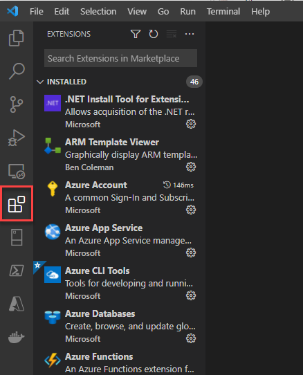
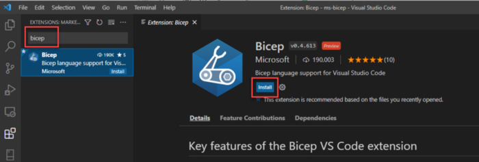
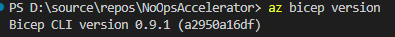
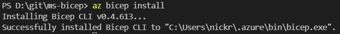
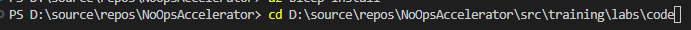

# NoOps Accelerator Labs
## Module: NoOps - Lab - Create Bicep template with NoOps
### Lab Manual
**Conditions and Terms of Use**  

The contents of this package are for informational and training purposes only and are provided "as is" without warranty of any kind, whether express or implied, including but not limited to the implied warranties of merchantability, fitness for a particular purpose, and non-infringement.

Training package content, including URLs and other Internet Web site references, is subject to change without notice. Because Microsoft must respond to changing market conditions, the content should not be interpreted to be a commitment on the part of Microsoft, and Microsoft cannot guarantee the accuracy of any information presented after the date of publication. Unless otherwise noted, the companies, organizations, products, domain names, e-mail addresses, logos, people, places, and events depicted herein are fictitious, and no association with any real company, organization, product, domain name, e-mail address, logo, person, place, or event is intended or should be inferred.

**Copyright and Trademarks**

© Microsoft Corporation. All rights reserved.

Microsoft may have patents, patent applications, trademarks, copyrights, or other intellectual property rights covering subject matter in this document. Except as expressly provided in written license agreement from Microsoft, the furnishing of this document does not give you any license to these patents, trademarks, copyrights, or other intellectual property.

Complying with all applicable copyright laws is the responsibility of the user. Without limiting the rights under copyright, no part of this document may be reproduced, stored in or introduced into a retrieval system, or transmitted in any form or by any means (electronic, mechanical, photocopying, recording, or otherwise), or for any purpose, without the express written permission of Microsoft Corporation.

For more information, see **Use of Microsoft Copyrighted Content** at [https://www.microsoft.com/en-us/legal/copyright/permissions](https://www.microsoft.com/en-us/legal/copyright/permissions)

Microsoft®, Internet Explorer®, and Windows® are either registered trademarks or trademarks of Microsoft Corporation in the United States and/or other countries. Other Microsoft products mentioned herein may be either registered trademarks or trademarks of Microsoft Corporation in the United States and/or other countries. All other trademarks are property of their respective owners.

</br>

## Contents
[**Introduction**](#introduction)  
[**Objectives**](#objectives)  
[**Prerequisites**](#prerequisites)

<div style="page-break-after: always;"></div>

<a name="Introduction"></a>

## Introduction ##

Other than provisioning infrastructure directly in the azure cloud portal, or even via some form of CLI, Infrastructure-as-Code presents a method of deploying infrastructure to the Azure cloud declaratively, efficiently, and in an instructional manner. Bicep is an accessible and easier-to-understand templating language for deploying Azure resources than its counterpart, ARM templates. Where ARM templates are written in JSON and can be hard to read and author, the Bicep language has a simpler syntax for both reading and creating templates. However, Bicep templates are still inextricably linked to ARM templates.

In this lab, you will create a basic Bicep template to understand the new templating syntax and how it relates to ARM templates.

<a name="Objectives"></a>
### Objectives ###

Upon completion of this lab, you will be able to:

- Understand the benefits of authoring templates in the Bicep language over JSON-based ARM Templates
- Understand the basic principles of Infrastructure-as-Code
- Understand the relationship between Bicep and the Azure Resource Manager
- Add relevant resources to Bicep templates

<a name="Prerequisites"></a>
### Prerequisites ###

Familiarity with the following will be beneficial, but is not required:

- Azure Storage Account concepts
- A basic understanding of JSON
- Familiarity with the Azure CLI

Installation required:
- [Visual Studio Code](https://code.visualstudio.com/) with the [Bicep](https://marketplace.visualstudio.com/items?itemName=ms-dotnettools.csharp) extension installed.

- [Git for Windows](https://gitforwindows.org/) 2.33.0 or later.

- This lab requires you to complete the Setup Azure instructions.

**Estimated Time to Complete This Lab**  
60 minutes

<div style="page-break-after: always;"></div>

<a name="Exercise1"></a>
## Exercise 1: Configuring the lab environment ##

<a name="Ex1Task1"></a>
### Task 1: Configuring Visual Studio Code ###

1. Open **Visual Studio Code**. In this task, you will configure a Git credential helper to securely store the Git credentials used to communicate with Azure DevOps. If you have already configured a credential helper and Git identity, you can skip to the next task.

1. From the main menu, select **Terminal \| New Terminal** to open a terminal window.

1. Execute the command below to configure a credential helper.

    ```
    git config --global credential.helper wincred
    ```
1. The commands below will configure your user name and email for Git commits. Replace the parameters with your preferred user name and email and execute them.

    ```
    git config --global user.name "John Doe"
    git config --global user.email johndoe@example.com
    ```

<a name="Exercise2"></a>
## Exercise 2: Cloning the NoOps repository ##

<a name="Ex2Task1"></a>
### Task 1: Cloning NoOps repository ###

1. In a browser tab, navigate to the NoOps Accelerator git repo at [http://aka.ms/azurenoops](http://aka.ms/azurenoops).

1. Getting a local copy of a Git repo is called "cloning". Every mainstream development tool supports this and will be able to connect to GitHub to pull down the latest source to work with. Navigate to the **Repos** hub.

    

1. Click **Clone**.

    

1. Click the **Copy to clipboard** button next to the repo clone URL. You can plug this URL into any Git-compatible tool to get a copy of the codebase.

    

<a name="Exercise3"></a>
## Exercise 3: Configuring Visual Studio Code ##

<a name="Ex1Task1"></a>
### Task 1: Configuring Visual Studio Code for Bicep Extension ###

1. Open **Visual Studio Code**. In this task, you will dow(nalod and install the [VS Code extension](https://marketplace.visualstudio.com/items?itemName=ms-azuretools.vscode-bicep) for bicep. If you have already configured the extension, you can skip to the next task.

1. Click on the Extensions button.



2. In the search bar, type **“bicep”**. You should see a single Bicep extension appear. When this happens, click on Install. After a few moments, VS Code will install the Bicep extension.



3. After the install, proceed to Exercise 2

>NOTE: Even though the next section will give you the Bicep template to copy/paste, you’ll undoubtedly have times when you need to create Bicep templates from scratch. The Bicep extension in VS Code comes in handy here particularly due to its Intellisense features.

>NOTE: Notice that if you open a file with an extension of .bicep in VS Code, VS Code will attempt to provide shortcuts for you. For example, you create Azure resources with the resource keyword in a Bicep template. With the Bicep extension installed, VS Code understands this.

<a name="Exercise4"></a>
## Exercise 4: Installing the Bicep CLI ##

Next steps, in order to invoke Bicep templates you will need to install the Bicep CLI.

<a name="Ex1Task1"></a>
### Task 1: Find Bicep CLI ###

Before attempting to install the Bicep CLI, first check to see if it’s already installed. Depending on the version of the Azure CLI you have installed, you may already have the Bicep CLI.

1. Open a PowerShell console or terminal and check for the version of the Bicep CLI.

2. Check bicep version

```
az bicep version
```

If you have the Bicep CLI installed, you’ll see a version statement, as shown below.



> NOTE: If you see an error message about the Bicep CLI not being found, continue to Task 2

<a name="Ex1Task2"></a>
### Task 2: Install Bicep CLI ###

1. Run the install subcommand to install the Bicep CLI.

```
az bicep install
```

You will now see the output as below. It confirms that the Bicep CLI has been successfully installed and is ready for use.



> NOTE: As an alternate installation method, you can also install the Bicep CLI via the [Bicep Windows Installer](https://github.com/Azure/bicep/releases/latest/download/bicep-setup-win-x64.exe).

<a name="Exercise5"></a>
## Exercise 5: Creating a NoOps Bicep Template to Deploy a Storage Account ##

You can deploy some complex Azure resources with NoOps Accelerator but let’s start off slow. For your first NoOps Accelerator Bicep template, let’s create a simple Azure storage account that you can then use to deploy to Azure.

1. Open **VS Code**, navigate to the 'training/labs/code/workloads' and create a new folder called wl-storage-account.

2. Create a new file called deploy.bicep in the newly created folder 'wl-storage-account'. You don’t have to name the file exactly as shown here but following Bicep’s lead calling the template deploy with a .bicep extension is common.

3. Create a new file called deploy.parameters.json in the newly created folder 'wl-storage-account'.

4. Copy and paste the Bicep template code below into files and save it. After the save you should have 2 files. One is the main.bicep file and the other is the bicep paramters json file. In order to understand this template, review the various attributes that make up a NoOps Bicep template below.

Some attributes common to all NoOps Bicep templates:

- name – The module identifier (module modStorageAccount) – Tells Bicep to create a new resource. This name identifies the particular resource within the Bicep template. This name is not the name of the resource that is created in Azure.

- scope – Defines the scope to use.
  
You’ll also see some attributes specific to the NoOps storageAccounts resource type:

- name - The name of the resource as it appears in Azure (pay attention to the rules and restrictions for naming Azure resources.)
  
- parLocation – The Azure region to create the resource in as a parmeter.

- storageAccountSku – The storage account SKU (Standard_LRS) as defined in the property name.

- params – Various resource-specific parameters that don’t have their own section such as accessTier in this example. These parameters are the same as you’ll find in ARM templates.
  
> NOTE: From a consumer’s perspective, any Bicep file is potentially a module. Since mostly all of the NoOps modules are based off the AzResurces Modules. We are just using AzResurces Modules as building blocks to create more advanced cases of modules for deployment.

Bicep file

``` Bicep
// === PARAMETERS ===
targetScope = 'resourceGroup'

// SUBSCRIPTIONS PARAMETERS

@description('The subscription ID for the Hub Network and resources. It defaults to the deployment subscription.')
param parTargetSubscriptionId string = subscription().subscriptionId

@description('The name of the resource group in which the key vault will be deployed. If unchanged or not specified, the NoOps Accelerator shared services resource group is used.')
param parTargetResourceGroup string

// RESOURCE NAMING PARAMETERS

@description('A suffix to use for naming deployments uniquely. It defaults to the Bicep resolution of the "utcNow()" function.')
param parDeploymentNameSuffix string = utcNow()

// STORAGE ACCOUNTS PARAMETERS

param parSkuName string


//=== Storage Account Buildout === 
@description('Storage Account Resource Group')
module modStorageAccountResourceGroup '../../azresources/Modules/Microsoft.Resources/resourceGroups/az.resource.groups.bicep' = {
  name: 'deploy-Storage-rg-${parLocation}-${parDeploymentNameSuffix}'
  scope: subscription(parTargetSubscriptionId)
  params: {
    name: 'StorageResourceGroup'
    location: parLocation
  }
}

module modStorageAccount '../../azresources/Modules/Microsoft.Storage/storageAccounts/az.data.storage.bicep' = {
  scope: resourceGroup(parTargetSubscriptionId, resTargetASPResourceGroup.name)
  name: 'deploy-storage-account-${parLocation}-${parDeploymentNameSuffix}'
  params: {
    location: parLocation
    name: 'myStorageAccount'
    storageAccountSku: parSkuName 
  } 
}
//=== End Storage Account Buildout === 

```

Parameters Json file

```json
{
    "$schema": "https://schema.management.azure.com/schemas/2019-04-01/deploymentParameters.json#",
    "contentVersion": "1.0.0.0",
    "parameters": {
        "parTargetSubscriptionId": {
            "value": "xxxxxxx-xxxx-xxxx-xxxx-xxxxxxxxxxx"
        },
        "parTargetResourceGroup": {
            "value": "name-lab-rg"
        },
        "parSkuName": {
            "value": "Standard_LRS"
        },
    }
}
```

<a name="Exercise6"></a>
## Exercise 6: Deploying the NoOps Bicep Template to Azure ###

Let’s now cover deploying your recently-built Bicep template with the Azure CLI.

> NOTE: Be sure you have [Azure CLI v2.2.0+](https://adamtheautomator.com/install-azure-cli/) installed and [signed in](https://docs.microsoft.com/en-us/cli/azure/authenticate-azure-cli) before starting this section.

<a name="Ex1Task1"></a>
### Task 1: Deploy Bicep file via CLI ###

1. Open PowerShell or another terminal open

2. Change directory to where the templates are.



3. Invoke an ARM deployment with the az deployment sub create command. Copy and paste the command from below.

> NOTE: This command performs an ARM deployment just like with PowerShell. Be sure to specify the resource-group to deploy to along with the Bicep template created earlier via the template-file parameter.

```bash
az deployment sub create --name deploy-storage --location EastUS --template-file deploy.bicep --parameters @deploy.parameters.bicep
```

If you see the provisioningState as Succeeded, as shown below, ARM has read the Bicep template and carried out all of the instructions.

3. Go to your portal and verify resource is in Azure
   
4. Clean up the resources from your Azure account

```bash
az resource delete -g ATA -n ata2021bicepdiskstorage --resource-type "Microsoft.Storage/storageAccounts"
```

<a name="Ex1Task2"></a>
### Task 2: Deploy Bicep file via Powershell ###
