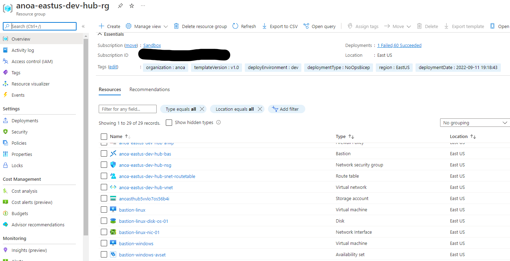

# Overlays: Remote Access - Bastion

## Overview

This overlay module adds a linux and windows virtual machines to the Hub resource group to serve as a jumpbox into the network using Azure Bastion Host as the remote desktop solution without exposing the virtual machine via a Public IP address.

Read on to understand what this overlay does, and when you're ready, collect all of the pre-requisites, then deploy the overlay

## About Azure Bastion Host

The docs on Azure Bastion: <https://docs.microsoft.com/en-us/azure/bastion/bastion-overview>

Some particulars about Bastion:

* Azure Bastion Host requires a subnet of /27 or larger
* The subnet must be titled AzureBastionSubnet
* Azure Bastion Hosts require a public IP address

## About Virtual Machines

This overlay module also deploys two virtual machines into a new subnet in the existing Hub virtual network to serve as jumpboxes.

The docs on Virtual Machines: <https://docs.microsoft.com/en-us/azure/templates/microsoft.compute/virtualmachines?tabs=json>

By default, this overlay will deploy resources into standard default hub/spoke subscriptions and resource groups.  

The subscription and resource group can be changed by providing the resource group name (Param: parTargetSubscriptionId/parTargetResourceGroup) and ensuring that the Azure context is set the proper subscription.  

## Pre-requisites

* A virtual network and subnet is deployed. (a deployment of [deploy.bicep](../../../../bicep/platforms/lz-platform-scca-hub-3spoke/deploy.bicep))
* Decide if the optional parameters is appropriate for your deployment. If it needs to change, override one of the optional parameters.

## Parameters

See below for information on how to use the appropriate deployment parameters for use with this overlay:

Required Parameters | Type | Allowed Values | Description
| :-- | :-- | :-- | :-- |
parRequired | object | {object} | Required values used with all resources.
parTags | object | {object} | Required tags values used with all resources.
parLocation | string | `[deployment().location]` | The region to deploy resources into. It defaults to the deployment location.
parRemoteAccess | object | {object} | The object parameters of the Microsoft Bastion Host.
parHubResourceGroupName | string | `anoa-eastus-platforms-hub-rg` | The resource group that contains the Hub Virtual Network and deploy the virtual machines into
parHubVirtualNetworkName | string | `anoa-eastus-platforms-hub-vnet` | The resource to deploy a subnet configured for Bastion Host
parHubSubnetResourceId | string | `/subscriptions/xxxxxxxx-xxxxxx-xxxxx-xxxxxx-xxxxxx/resourceGroups/anoa-eastus-platforms-hub-rg/providers/Microsoft.Network/virtualNetworks/anoa-eastus-platforms-hub-vnet/subnets/anoa-eastus-platforms-hub-snet` | The resource ID of the subnet in the Hub Virtual Network for hosting virtual machines
parHubNetworkSecurityGroupResourceId | string | `/subscriptions/xxxxxxxx-xxxxxx-xxxxx-xxxxxx-xxxxxx/resourceGroups/anoa-eastus-platforms-hub-rg/providers/Microsoft.Network/networkSecurityGroups/anoa-eastus-platforms-hub-nsg` | The resource ID of the Network Security Group in the Hub Virtual Network that hosts rules for Hub Subnet traffic
parLogAnalyticsWorkspaceId | string | `/subscriptions/xxxxxxxx-xxxxxx-xxxxx-xxxxxx-xxxxxx/resourcegroups/anoa-eastus-platforms-logging-rg/providers/microsoft.operationalinsights/workspaces/anoa-eastus-platforms-logging-log` | Log Analytics Workspace Resource Id Needed for Bastion

Optional Parameters | Description
------------------- | -----------
None

## Deploy the Overlay

Connect to the appropriate Azure Environment and set appropriate context, see getting started with Azure PowerShell or Azure CLI for help if needed. The commands below assume you are deploying in Azure Commercial and show the entire process from deploying Platform Hub/Spoke Design and then adding an Remote Access - Bastion post-deployment.

> NOTE: Since you can deploy this overlay post-deployment, you can also build this overlay within other deployment models such as Platforms & Workloads.

Once you have the hub/spoke output values, you can pass those in as parameters to this deployment.

For example, deploying using the `az deployment sub create` command in the Azure CLI:

### Azure CLI

```bash
# For Azure Commerical regions
az login
cd src/bicep
cd platforms/lz-platform-scca-hub-3spoke
az deployment sub create \ 
--name contoso \
--subscription xxxxxx-xxxx-xxxx-xxxx-xxxxxxxxx \
--template-file platforms/lz-platform-scca-hub-3spoke/deploy.bicep \
--location eastus \
--parameters @platforms/lz-platform-scca-hub-3spoke/parameters/deploy.parameters.json
cd overlays
cd bastion
az deployment sub create \
   --name deploy-RemoteAccess
   --template-file overlays/bastion/deploy.bicep \
   --parameters @overlays/bastion/deploy.parameters.json \
   --subscription xxxxxx-xxxx-xxxx-xxxx-xxxxxxxxx \
   --location 'eastus'
```

OR

```bash
# For Azure Government regions
az deployment sub create \
  --template-file overlays/bastion/deploy.bicep \
  --parameters @overlays/bastion/deploy.parameters.json \
  --subscription xxxxxx-xxxx-xxxx-xxxx-xxxxxxxxx \
  --location 'usgovvirginia'
```

### PowerShell

```powershell
# For Azure Commerical regions
New-AzSubscriptionDeployment `
  -ManagementGroupId xxxxxxx-xxxx-xxxxxx-xxxxx-xxxx
  -TemplateFile overlays/bastion/deploy.bicepp `
  -TemplateParameterFile overlays/bastion/deploy.parameters.json `
  -Subscription xxxxxx-xxxx-xxxx-xxxx-xxxxxxxxx `
  -Location 'eastus'
```

OR

```powershell
# For Azure Government regions
New-AzSubscriptionDeployment `
  -ManagementGroupId xxxxxxx-xxxx-xxxxxx-xxxxx-xxxx
  -TemplateFile overlays/bastion/deploy.bicepp `
  -TemplateParameterFile overlays/bastion/deploy.parameters.json `
  -Subscription xxxxxx-xxxx-xxxx-xxxx-xxxxxxxxx `
  -Location  'usgovvirginia'
```

## Extending the Overlay

By default, this overlay has the minium parmeters needed to deploy the service. If you like to add addtional parmeters to the service, please refer to the module description located in AzResources here: [`Bastion Hosts `[Microsoft.Network/bastionHosts]``](../../../azresources/Modules/Microsoft.Network/bastionHost/readme.mdazresources\Modules)

## Air-Gapped Clouds

For air-gapped clouds it may be convenient to transfer and deploy the compiled ARM template instead of the Bicep template if the Bicep CLI tools are not available or if it is desirable to transfer only one file into the air gap.

## Validate the deployment

Use the Azure portal, Azure CLI, or Azure PowerShell to list the deployed resources in the resource group.

Configure the default group using:

```bash
az configure --defaults group=anoa-eastus-hub-bastion-rg.
```

```bash
az resource list --location eastus --subscription xxxxxx-xxxx-xxxx-xxxx-xxxxxxxx --resource-group anoa-eastus-hub-bastion-rg
```

OR

```powershell
Get-AzResource -ResourceGroupName anoa-eastus-hub-bastion-rg
```

## Cleanup

The Bicep/ARM deployment of NoOps Accelerator - Remote Access - Bastion deployment can be deleted with these steps:

### Delete Resource Groups

```bash
az group delete --name anoa-eastus-hub-bastion-rg
```

OR

```powershell
Remove-AzResourceGroup -Name anoa-eastus-hub-bastion-rg
```

### Delete Deployments

```bash
az deployment delete --name deploy-RemoteAccess
```

OR

```powershell
Remove-AzSubscriptionDeployment -Name deploy-RemoteAccess
```

## Example Output in Azure


