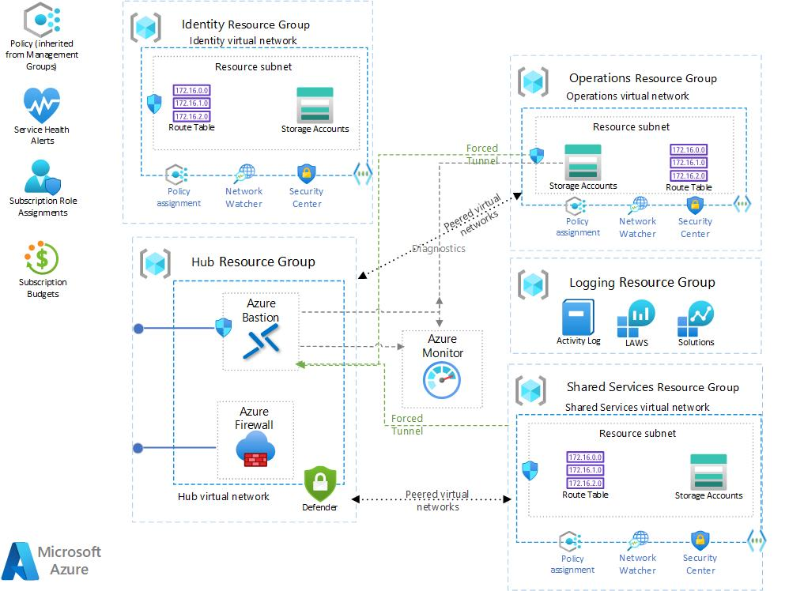

# NoOps Accelerator - Platforms - SCCA Compliant Hub - 3 Spoke Landing Zone

## Overview

This platform module deploys Hub 3 Spoke landing zone.

> NOTE: This is only the landing zone deployment. The workloads will be deployed with the enclave or can be deployed after the landing zone is created.

Read on to understand what this landing zone does, and when you're ready, collect all of the pre-requisites, then deploy the landing zone.

## Architecture

 

## About Hub 3 Spoke Landing Zone

The docs on Hub/Spoke Landing Zone: <https://learn.microsoft.com/en-us/azure/architecture/reference-architectures/hybrid-networking/hub-spoke?tabs=cli>

### What is a Landing Zone?

A **landing zone** is networking infrastructure configured to provide a secure environment for hosting workloads.

[](https://youtu.be/9BKgz9Rl1eo "Don't let this happen to you 😮 Build A Landing Zone 👍 - Click to Watch!")

### Hub/Spoke Networking

Hub/ 3 Spoke Networking (like Mission Landing Zone) is set up in a hub and spoke design, separated by tiers: T0 (Identity and Authorization), T1 (Infrastructure Operations), T2 (DevSecOps and Shared Services), and multiple T3s (Workloads). Access control can be configured to allow separation of duties between all tiers.

### Firewall

All network traffic is directed through the firewall residing in the Network Hub resource group. The firewall is configured as the default route for all the T0 (Identity and Authorization) through T3 (workload/team environments) resource groups as follows:

|Name         |Address prefix| Next hop type| Next hop IP address|
|-------------|--------------|-----------------|-----------------|
|default_route| 0.0.0.0/0    |Virtual Appliance|10.0.100.4*       |

*-example IP for firewall

The default firewall configured for Hub/ 1 Spoke Landing Zone is [Azure Firewall Premium](https://docs.microsoft.com/en-us/azure/firewall/premium-features).

Presently, there are two firewall rules configured to ensure access to the Azure Portal and to facilitate interactive logon via PowerShell and Azure CLI, all other traffic is restricted by default. Below are the collection of rules configured for Azure Commercial and Azure Government clouds:

|Rule Collection Priority | Rule Collection Name | Rule name | Source | Port     | Protocol                               |
|-------------------------|----------------------|-----------|--------|----------|----------------------------------------|
|100                      | AllowAzureCloud      | AzureCloud|*       |   *      |Any                                     |
|110                      | AzureAuth            | msftauth  |  *     | Https:443| aadcdn.msftauth.net, aadcdn.msauth.net |

### Naming Conventions

By default, Hub - 3 Spoke Platform resources are named according to a naming convention that uses the mandatory `orgPrefix` (that is defaulted to `anoa`), `templateVersion` & `deployEnvironment`.

#### Default Naming Convention Example

Let's look at an example using `parRequired="{ \"orgPrefix\":\"$ORG_PREFIX\", \"templateVersion\":\"v1.0\", \"deployEnvironment\":\"$DEPLOY_ENV\" }"`

In `deploy.bicep` you will find a variable titled `namingConvention`:

```bicep
var varNamingConvention = '${toLower(parRequired.orgPrefix)}-${toLower(parLocation)}-${toLower(parRequired.deployEnvironment)}-${varNameToken}-${toLower(varResourceToken)}'

# this generates a value of: ${orgPrefix}-${location}-${deployEnvironment}-${nameToken}-${resourceToken}
```

This naming convention uses Bicep's `replace()` function to substitute resource abbreviations for `resourceToken` and resource names for `nameToken`.

For example, when naming the Hub Resource Group, first the `resourceToken` is substituted with the recommended abbreviation `rg`:

```bicep
var resourceGroupNamingConvention = replace(namingConvention, resourceToken, 'rg')
# this generates a value of: anoa-eastus-${nameToken}-dev-rg
```

Then, the `nameToken` is substituted with the Azure NoOps Accelerator name `hub`:

```bicep
var hubResourceGroupName =  replace(resourceGroupNamingConvention, nameToken, 'hub')
# this generates a value of: anoa-eastus-hub-dev-rg
```

Finally, the `hubResourceGroupName` is assigned to the resource group `varHubName` variable:

```bicep
var varHubName = 'hub'
var varHubResourceGroupName = replace(varResourceGroupNamingConvention, varNameToken, varHubName)

# this is the calculated value 'anoa-eastus-hub-dev-rg'
```

### Tagging

Organize cloud resources to meet the needs of governance, operational management, and accounting. Resources can be managed and found more quickly with the aid of well-defined metadata tagging protocols. By using charge back and show back accounting procedures, these conventions also assist in tying cloud usage charges to specific business teams.

A tagging strategy include business and operational details:

* The business side of this strategy ensures that tags include the organizational information needed to identify the teams. Use a resource along with the business owners who are responsible for resource costs.
* The operational side ensures that tags include information that IT teams use to identify the workload, application, environment, criticality, and other information useful for managing resources.

## Pre-requisites

### Subscriptions

Most customers will deploy each tier to a separate Azure subscription, but multiple subscriptions are not required. A single subscription deployment is good for a testing and evaluation, or possibly a small IT Admin team.

Hub - 3 Spoke Platform can deploy to a single subscription or multiple subscriptions. A test and evaluation deployment may deploy everything to a single subscription, and a production deployment may place each tier into its own subscription.

The optional parameters related to subscriptions are below. They releated to each tier object used for deployment.

Parameter name | Default Value | Description
-------------- | ------------- | -----------
`parHub.subscriptionId` | Deployment subscription | Subscription containing the firewall and network hub
`parIdentitySpoke.subscriptionId` | Deployment subscription | Tier 0 for identity solutions
`parOperationsSpoke.subscriptionId` | Deployment subscription | Tier 1 for network operations, logging and security tools
`parSharedServicesSpoke.subscriptionId` | Deployment subscription | Tier 2 for shared services

### Networking

The following parameters affect networking. They releated to each tier object used for deployment.

Parameter name | Default Value | Description
-------------- | ------------- | -----------
`parHub.virtualNetworkAddressPrefix` | '10.0.100.0/24' | The CIDR Virtual Network Address Prefix for the Hub Virtual Network.
`parHub.subnetAddressPrefix` | '10.0.100.128/27' | The CIDR Subnet Address Prefix for the default Hub subnet. It must be in the Hub Virtual Network space.
`parHub.peerToSpokeVirtualNetwork` | true | This is a switch for peering to an Spoke Network. This is used with the spoke network peering as well. Both parameters either need to be true or false.
`parHub.subnets.addressPrefix` (Firewall Client Subnet Address Prefix)| '10.0.100.0/26' | The CIDR Subnet Address Prefix for the Azure Firewall Subnet. It must be in the Hub Virtual Network space. It must be /26.
`parHub.subnets.addressPrefix` (Firewall Management Subnet Address Prefix) | '10.0.100.64/26' | The CIDR Subnet Address Prefix for the Azure Firewall Management Subnet. It must be in the Hub Virtual Network space. It must be /26.
`parIdentitySpoke.virtualNetworkAddressPrefix` | '10.0.110.0/26' | The CIDR Virtual Network Address Prefix for the Identity Virtual Network.
`parIdentitySpoke.subnetAddressPrefix` | '10.0.110.0/27' | The CIDR Subnet Address Prefix for the default Identity subnet. It must be in the Identity Virtual Network space.
`parIdentitySpoke.peerToHubVirtualNetwork` | true | This is a switch for peering to an Hub Network from a Identity Spoke. This is used with the hub network peering as well. Both parameters either need to be true or false.
`parOperationsSpoke.virtualNetworkAddressPrefix` | '10.0.115.0/26' | The CIDR Virtual Network Address Prefix for the Operations Virtual Network.
`parOperationsSpoke.subnetAddressPrefix` | '10.0.115.0/27' | The CIDR Subnet Address Prefix for the default Operations subnet. It must be in the Operations Virtual Network space.
`parOperationsSpoke.peerToHubVirtualNetwork` | true | This is a switch for peering to an Hub Network from a Operations Spoke. This is used with the hub network peering as well. Both parameters either need to be true or false.
`parSharedServicesSpoke.virtualNetworkAddressPrefix` | '10.0.120.0/26' | The CIDR Virtual Network Address Prefix for the Shared Services Virtual Network.
`parSharedServicesSpoke.subnetAddressPrefix` | '10.0.120.0/27' | The CIDR Subnet Address Prefix for the default Shared Services subnet. It must be in the Shared Services Virtual Network space.
`parSharedServicesSpoke.peerToHubVirtualNetwork` | true | This is a switch for peering to an Hub Network from a SharedServices Spoke. This is used with the hub network peering as well. Both parameters either need to be true or false.

## Optional Features

Hub - 3 Spoke Platform has optional features that can be enabled by setting parameters on the deployment.

### Microsoft Defender for Cloud

By default [Microsoft Defender for Cloud](https://docs.microsoft.com/en-us/azure/defender-for-cloud/defender-for-cloud-introduction) offers a free set of monitoring capabilities that are enabled via an Azure policy when you first set up a subscription and view the Microsoft Defender for Cloud portal blade.

Microsoft Defender for Cloud offers a standard/defender sku which enables a greater depth of awareness including more recomendations and threat analytics. You can enable this higher depth level of security in Hub - 3 Spoke Platform by setting the parameter `parSecurityCenter.enableDefender` during deployment. In addition you can include the `parSecurityCenter.emailSecurityContact` parameter to set a contact email for alerts and `parSecurityCenter.phoneSecurityContact` parameter to set a contact phone for alerts.

Parameter name | Default Value | Description
-------------- | ------------- | -----------
`parSecurityCenter.enableDefender` | 'false' | When set to "true", enables Microsoft Defender for Cloud for the subscriptions used in the deployment. It defaults to "false".
`parSecurityCenter.emailSecurityContact` | '' | Email address of the contact, in the form of john@doe.com
`parSecurityCenter.phoneSecurityContact` | '' | Phone of the contact, in the form of 5555555555
`parSecurityCenter.alertNotifications` | '' | alert notifications for contact
`parSecurityCenter.alertsToAdminsNotifications` | '' | alert notifications for contact admin

The Defender plan by resource type for Microsoft Defender for Cloud is enabled by default in the following [Azure Environments](https://docs.microsoft.com/en-us/powershell/module/servicemanagement/azure.service/get-azureenvironment?view=azuresmps-4.0.0): `AzureCloud` and `AzureUSGovernment`. To enable this for other Azure Cloud environments, this will need to executed manually.
Documentation on how to do this can be found
[here](https://docs.microsoft.com/en-us/azure/defender-for-cloud/enable-enhanced-security)

### Azure Sentinel

[Sentinel](https://docs.microsoft.com/en-us/azure/sentinel/overview) is a scalable, cloud-native, security information and event management (SIEM) and security orchestration, automation, and response (SOAR) solution. Sentinel can be enabled by setting the `parLogging.enableSentinel` parameter.

Parameter name | Default Value | Description
-------------- | ------------- | -----------
`parLogging.enableSentinel` | 'false' | When set to "true", enables Microsoft Sentinel within the Log Analytics Workspace created in this deployment. It defaults to "false".

### Remote access with a Bastion Host

If you want to remotely access the network and the resources you've deployed you can use [Azure Bastion](https://docs.microsoft.com/en-us/azure/bastion/) to remotely access virtual machines within the network without exposing them via Public IP Addresses.

Deploy a Linux and Windows virtual machine as jumpboxes into the network without a Public IP Address using Azure Bastion Host by providing values for these parameters:

Parameter name | Default Value | Description
-------------- | ------------- | -----------
`parRemoteAccess.enable` | 'false' | When set to "true", provisions Azure Bastion Host and virtual machine jumpboxes. It defaults to "false".
`parRemoteAccess.windows.vmAdminPassword` | 'Rem0te@2020246' | The administrator password the Windows Virtual Machine to Azure Bastion remote into. It must be > 12 characters in length. See [password requirements for creating a Windows VM](https://docs.microsoft.com/en-us/azure/virtual-machines/windows/faq#what-are-the-password-requirements-when-creating-a-vm-).
`parRemoteAccess.linux.vmAuthenticationType` | 'Rem0te@2020246' | [sshPublicKey/password] The authentication type for the Linux Virtual Machine to Azure Bastion remote into. It defaults to "Rem0te@2020246".
`parRemoteAccess.linux.vmAdminPasswordOrKey` | new guid | The administrator password or public SSH key for the Linux Virtual Machine to Azure Bastion remote into. See [password requirements for creating a Linux VM](https://docs.microsoft.com/en-us/azure/virtual-machines/linux/faq#what-are-the-password-requirements-when-creating-a-vm-).
`parRemoteAccess.windows.vmAdminUsername` | 'azureuser' | The administrator username for the Linux Virtual Machine to Azure Bastion remote into. It defaults to "azureuser".
`parRemoteAccess.linux.vmAdminUsername` | 'azureuser' | The administrator username for the Linux Virtual Machine to Azure Bastion remote into. It defaults to "azureuser".

### Azure Firewall Premium

By default, Hub - 3 Spoke Platform deploys **[Azure Firewall Premium](https://docs.microsoft.com/en-us/azure/firewall/premium-features). Not all regions support Azure Firewall Premium.** Check here to [see if the region you're deploying to supports Azure Firewall Premium](https://docs.microsoft.com/en-us/azure/firewall/premium-features#supported-regions). If necessary you can set a different firewall SKU or location.

You can manually specify which SKU of Azure Firewall to use for your deployment by specifying the `parAzureFirewall.skuTier` parameter. This parameter only accepts values of `Standard` or `Premium`.

Parameter name | Default Value | Description
-------------- | ------------- | -----------
`parAzureFirewall.skuTier` | 'Premium' | [Standard/Premium] The SKU for Azure Firewall. It defaults to "Premium".

If you'd like to specify a different region to deploy your resources into, change the location of the deployment. For example, when using the AZ CLI set the deployment command's `--location` argument.

### Operational Network Artifacts

If needed, The Operational Network Artifacts are used when operations wants to seperate all key, secrets and operations storage from the hub/spoke model.

### DDOS

If needed, You can deploy an DDOS Standard configuration if a firewall is not needed.

## Parameters

See below for information on how to use the appropriate deployment parameters for use with this landing zone:

Required Parameters | Type | Allowed Values | Description
| :-- | :-- | :-- | :-- |
parRequired | object | {object} | Required values used with all resources.
parTags | object | {object} | Required tags values used with all resources.
parLocation | string | `[deployment().location]` | The region to deploy resources into. It defaults to the deployment location.
parHub | object | {object} | Hub Virtual network configuration. See [azresources/hub-spoke-core/vdss/hub/readme.md](../../azresources/hub-spoke-core/vdss/hub/readme.md)
parOperationsSpoke | object | {object} | Operations Spoke Virtual network configuration. See [See azresources/hub-spoke-core/vdms/operations/readme.md](../../azresources/hub-spoke-core/vdms/operations/readme.md)
parIdentitySpoke | object | {object} | Identity Spoke Virtual network configuration. See [See azresources/hub-spoke-core/vdss/identity/readme.md](../../azresources/hub-spoke-core/vdss/identity/readme.md)
parSharedServicesSpoke | object | {object} | Shared Services Spoke Virtual network configuration. See [See azresources/hub-spoke-core/vdms/sharedservices/readme.md](../../azresources/hub-spoke-core/vdms/sharedservices/readme.md)
parAzureFirewall | object | {object} | Azure Firewall configuration. Azure Firewall is deployed in Forced Tunneling mode where a route table must be added as the next hop.
parLogging | object | {object} | Enables logging parmeters and Microsoft Sentinel within the Log Analytics Workspace created in this deployment. See [azresources/hub-spoke-core/vdms/logging/readme.md](../../azresources/hub-spoke-core/vdms/logging/readme.md)
parRemoteAccess | object | {object} | Provisions Azure Bastion Host. See [overlays/management-services/bastion/readme.md](../../overlays/management-services/bastion/readme.md)

Optional Parameters | Type | Allowed Values | Description
| :-- | :-- | :-- | :-- |
parNetworkArtifacts | object | {object} | Optional. Enables Operations Network Artifacts Resource Group with KV and Storage account for the ops subscriptions used in the deployment. This overlay allows Bastion keys to be added if Basion Host is enabled. See [azresources/hub-spoke-core/vdss/networkArtifacts/readme.md](../../azresources/hub-spoke-core/vdss/networkArtifacts/readme.md)
parSecurityCenter | object | {object} | Microsoft Defender for Cloud.  It includes email and phone. See [overlays/management-services/defender/readme.md](../../overlays/management-services/defender/readme.md)
parDdosStandard | bool | `false` | DDOS Standard configuration.

## Deploy the Platform Landing Zone

Connect to the appropriate Azure Environment and set appropriate context, see getting started with Azure PowerShell or Azure CLI for help if needed. The commands below assume you are deploying in Azure Commercial and show the entire process deploying Platform Hub/Spoke Design.

For example, deploying using the `az deployment sub create` command in the Azure CLI:

### Azure CLI

```bash
# For Azure Commerical regions

# When deploying to Azure cloud, first set the cloud.
az cloudset --name AzureCloud

# Set Platform connectivity subscription ID as the the current subscription 
$ConnectivitySubscriptionId="[your platform management subscription ID]"
az account set --subscription $ConnectivitySubscriptionId

#log in
az login
cd src/bicep
cd platforms/lz-platform-scca-hub-3spoke
az deployment sub create \ 
--name deploy-hub1spoke-network \
--subscription $ConnectivitySubscriptionId \
--template-file deploy.bicep \
--location eastus \
--parameters @parameters/deploy.parameters.json
```

OR

```bash
# For Azure Government regions

# When deploying to another cloud, like Azure US Government, first set the cloud and log in.
az cloudset --name AzureGovernment

# Set Platform connectivity subscription ID as the the current subscription
$ConnectivitySubscriptionId="[your platform management subscription ID]"
az account set --subscription $ConnectivitySubscriptionId

az login
cd src/bicep
cd platforms/lz-platform-scca-hub-3spoke
az deployment sub create \
  --name deploy-hub1spoke-network \
  --template-file deploy.bicep \
  --parameters @parameters/deploy.parameters.json \
  --subscription $ConnectivitySubscriptionId \
  --location 'usgovvirginia'
```

### PowerShell

```powershell
# For Azure Commerical regions
# When deploying to Azure cloud, first set the cloud and log in.
Connect-AzAccount -EnvironmentName AzureCloud

# Set Platform connectivity subscription ID as the the current subscription
$ConnectivitySubscriptionId = "[your platform management subscription ID]"
Select-AzSubscription -SubscriptionId $ConnectivitySubscriptionId

cd src/bicep
cd platforms/lz-platform-scca-hub-3spoke
New-AzSubscriptionDeployment `
  -Name deploy-hub1spoke-network `
  -TemplateFile deploy.bicep `
  -TemplateParameterFile deploy.parameters.json `
  -Subscription $ConnectivitySubscriptionId `
  -Location 'eastus'
```

OR

```powershell
# For Azure Government regions

# When deploying to another cloud, like Azure US Government, first set the cloud and log in.
Connect-AzAccount -EnvironmentName AzureUSGovernment

# Set Platform connectivity subscription ID as the the current subscription
$ConnectivitySubscriptionId = "[your platform management subscription ID]"
Select-AzSubscription -SubscriptionId $ConnectivitySubscriptionId

cd src/bicep
cd platforms/lz-platform-scca-hub-3spoke
New-AzSubscriptionDeployment `
  -Name deploy-hub1spoke-network `
  -TemplateFile deploy.bicep `
  -TemplateParameterFile deploy.parameters.json `
  -Subscription $ConnectivitySubscriptionId `
  -Location  'usgovvirginia'
```

## Extending the Landing Zone

By default, this Landing Zone has the minium parmeters needed to deploy the service. If you like to add addtional parmeters to the Landing Zone, please refer to the Landing Zone description located in AzResources here: [`Hub-Spoke-Core`](../../azresources/hub-spoke-core/readme.md)

## Air-Gapped Clouds

For air-gapped clouds it may be convenient to transfer and deploy the compiled ARM template instead of the Bicep template if the Bicep CLI tools are not available or if it is desirable to transfer only one file into the air gap.

## Validate the deployment

Use the Azure portal, Azure CLI, or Azure PowerShell to list the deployed resources in the resource group.

Configure the default group using:

```bash
az configure --defaults group=anoa-eastus-platforms-hub-rg.
```

```bash
az resource list --location eastus --subscription xxxxxx-xxxx-xxxx-xxxx-xxxxxxxx --resource-group anoa-eastus-platforms-hub-rg
```

```powershell
Get-AzResource -ResourceGroupName anoa-eastus-platforms-hub-rg
```

## Cleanup

The Bicep/ARM deployment of NoOps Accelerator - Hub/Spoke deployment can be deleted with these steps:

### Delete the diagnostic settings deployed at the subscription level

To delete the diagnostic settings from the Azure Portal: choose the subscription blade, then Activity log in the left panel. At the top of the Activity log screen click the Diagnostics settings button. From there you can click the Edit setting link and delete the diagnostic setting.

> NOTE: If you deploy and delete Mission Landing Zone in the same subscription multiple times without deleting the subscription-level diagnostic settings, the sixth deployment will fail. Azure has a limit of five diagnostic settings per subscription. The error will be similar to this: `"The limit of 5 diagnostic settings was reached."`

To delete the diagnotic settings in script, use the AZ CLI or PowerShell. An AZ CLI example is below:

```BASH
# View diagnostic settings in the current subscription
az monitor diagnostic-settings subscription list --query value[] --output table

# Delete a diagnostic setting
az monitor diagnostic-settings subscription delete --name <diagnostic setting name>
```

### Downgrade the Microsoft Defender for Cloud

To downgrade the Microsoft Defender for Cloud pricing level in the Azure portal:

1. Navigate to the Microsoft Defender for Cloud page, then click the "Environment settings" tab in the left navigation panel.
1. In the tree/grid select the subscription you want to manage.
1. Click the large box near the top of the page that says "Enhanced security off".
1. Click the save button.

To downgrade the Microsoft Defender for Cloud pricing level using the AZ CLI:

```BASH
# List the pricing tiers
az security pricing list -o table --query "value[].{Name:name, Tier:pricingTier}"

# Change a pricing tier to the default free tier
az security pricing create --name "<name of tier>" --tier Free
```

### Delete Resource Groups

```bash
az group delete -n anoa-eastus-platforms-logging-rg -y
az group delete -n anoa-eastus-platforms-hub-rg -y
az group delete -n anoa-eastus-platforms-identity-rg -y
az group delete -n anoa-eastus-platforms-operations-rg -y
az group delete -n anoa-eastus-platforms-sharedservices-rg -y
az group delete -n anoa-eastus-platforms-artifacts-rg -y
```

```powershell
Remove-AzResourceGroup -Name anoa-eastus-platforms-logging-rg
Remove-AzResourceGroup -Name anoa-eastus-platforms-hub-rg
Remove-AzResourceGroup -Name anoa-eastus-platforms-identity-rg
Remove-AzResourceGroup -Name anoa-eastus-platforms-operations-rg
Remove-AzResourceGroup -Name anoa-eastus-platforms-sharedservices-rg
Remove-AzResourceGroup -Name anoa-eastus-platforms-artifacts-rg
```

### Delete Deployments

```bash
az deployment sub delete -n deploy-hub3spoke-network
```

```powershell
Remove-AzSubscriptionDeployment -Name deploy-hub3spoke-network
```

## Resources

[Bicep documentation](https://aka.ms/bicep/)

[`az deployment` documentation](https://docs.microsoft.com/en-us/cli/azure/deployment?view=azure-cli-latest)

[JMESPath queries](https://jmespath.org/)

[Azure Az PowerShell module](https://docs.microsoft.com/en-us/powershell/azure/what-is-azure-powershell)