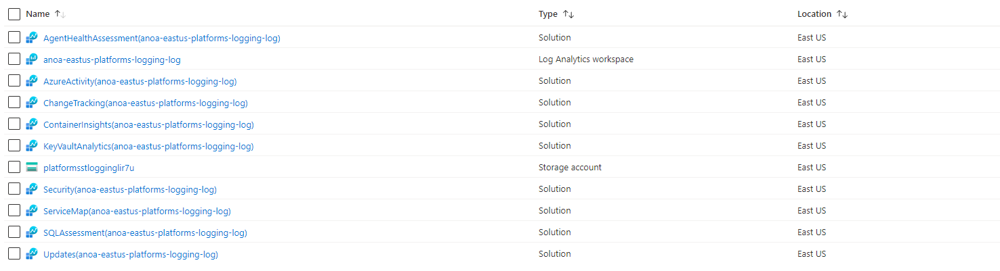

# Module:   NoOps Accelerator - Logging, & Sentinel

## Overview

This module defines Azure Log Analytics Workspace, Automation Account (linked together) & multiple Solutions deploy to the Log Analytics Workspace to an Logging Resource Group in the Hub Tier.

Automation Account will be linked to Log Analytics Workspace to provide integration for Update Management, Change Tracking and Inventory, and Start/Stop VMs during off-hours for your servers and virtual machines, if deployed. Only one mapping can exist between Log Analytics Workspace and Automation Account.

The module will deploy the following Log Analytics Workspace solutions by default. Solutions can be customized as required:

* AgentHealthAssessment
* AntiMalware
* AzureActivity
* ChangeTracking
* Security
* SecurityInsights (Azure Sentinel)
* ServiceMap
* SQLAssessment
* Updates
* VMInsights

Only certain regions are supported to link Log Analytics Workspace & Automation Account together (linked workspaces). Reference: Supported regions for linked Log Analytics workspace

## Required Parameters

The module requires the following inputs:

| Parameter                         | Type   | Default                                                                                              | Description                                                                                                                                                                                                                                                                                                                                                                                                                                                                                                                                 | Required                   | Example                                        |
 | --------------------------------- | ------ | ---------------------------------------------------------------------------------------------------- | ------------------------------------------------------------------------------------------------------------------------------------------------------------------------------------------------------------------------------------------------------------------------------------------------------------------------------------------------------------------------------------------------------------------------------------------------------------------------------------------------------------------------------------------- | ----------------------------- | ---------------------------------------------- |
| parOrgPrefix                       | string | `aona`                                                                           | Prefix value which will be prepended to all resource names. Default: anoa                                                                                                                                                                                                                                                                                                                                                                                                                                                                                             | Yes                          | `aona`
| parLocation                       | string | `resourceGroup().location`                                                                           | The Azure Region to deploy the resources into                                                                                                                                                                                                                                                                                                                                                                                                                                                                                               | Yes                          | `eastus`
| parTemplateVersion                       | string | `1.0`                                                                           | The ANOA template version                                                                                                                                                                                                                                                                                                                                                                                                                                                                                           | Yes                          | `1.o`
| parDeployEnvironment                       | string | None                                                                           | A suffix, 3 to 15 characters in length, to append to resource names (e.g. "dev", "test", "prod", "platforms"). It defaults to "platforms".'                                                                                                                                                                                                                                                                                                                                                                                                                                                                                           | Yes                          | `platforms`
| parResourcePrefix                       | string | None                       | A prefix, 3-15 alphanumeric characters without whitespace, used to prefix resources and generate uniqueness for resources with globally unique naming requirements like Storage Accounts and Log Analytics Workspaces.                                                                                                                                                                                                                                                                                                                                                                                                                                                                                          | Yes                          | None |

## Logging Parameters

The module requires the following inputs:

| Parameter                         | Type   | Default                                                                                              | Description                                                                                                                                                                                                                                                                                                                                                                                                                                                                                                                                 | Required                   | Example                                        |
 | --------------------------------- | ------ | ---------------------------------------------------------------------------------------------------- | ------------------------------------------------------------------------------------------------------------------------------------------------------------------------------------------------------------------------------------------------------------------------------------------------------------------------------------------------------------------------------------------------------------------------------------------------------------------------------------------------------------------------------------------- | ----------------------------- | ---------------------------------------------- |
| parDeployAutomationAccount | bool | `aona`                                                                          | Prefix value which will be prepended to all resource names. Default: anoa   | Yes  | `aona` |
| parLogAnalyticsWorkspaceCappingDailyQuotaGb | int | `aona`                                                                          | Prefix value which will be prepended to all resource names. Default: anoa   | Yes  | `aona` |
| parLogAnalyticsWorkspaceRetentionInDays | int | `aona`                                                                          | Prefix value which will be prepended to all resource names. Default: anoa   | Yes  | `aona` |
| parLogAnalyticsWorkspaceSkuName | string | `PerGB2018`                                                                          | Prefix value which will be prepended to all resource names. Default: anoa   | Yes  | `PerGB2018` |
| parDeploySentinel | bool | `false`                                                                          | Prefix value which will be prepended to all resource names. Default: anoa   | Yes  | `false` |
| parLogStorageSkuName | string | `Standard_GRS`                                                                          | Prefix value which will be prepended to all resource names. Default: anoa   | Yes  | `Standard_GRS` |
| parAddRoleAssignmentForStorageAccount | bool | `false`                                                                          | Prefix value which will be prepended to all resource names. Default: anoa   | Yes  | `false` |
| parStorageAccountAccessObjectId | string | `xxxx-xxxx-xxxx-xxxx-xxxx`                                                                          | Prefix value which will be prepended to all resource names. Default: anoa   | No  | `xxxx-xxxx-xxxx-xxxx-xxxx` |
| parStorageAccountAccessType | string | `Group`                                                                          | Prefix value which will be prepended to all resource names. Default: anoa   | No  | `Group` |

Parameters file located in the [Deployments](../../../../deployments/HubSpoke/logging/) folder under hub/spoke.

## Outputs

The module will generate the following outputs:

table

## Deployment

In this module, a Log Analytics Workspace and Automation Account will be deployed to the resource group anoa-eastus-platforms-logging-rg. The inputs for this module are defined in lz.logging.parameters.json.

There are separate input parameters files depending on which Azure cloud you are deploying because this module deploys resources into an existing resource group under the specified region. There is no change to the Bicep template file.

Other differences in Azure IL regions are as follow:

 | Azure Cloud    | Bicep template      | Input parameters file                    |
 | -------------- | ------------------- | ---------------------------------------- |
 | Global regions | anoa.lz.logging.bicep | anoa.lz.logging.parameters.json    |
 | IL regions  | anoa.lz.logging.bicep | anoa.lz.logging.parameters.json |

> For the examples below we assume you have downloaded or cloned the Git repo as-is and are in the root of the repository as your selected directory in your terminal of choice.

### Azure CLI

```bash
# For Azure global regions

# Set Platform connectivity subscription ID as the the current subscription 

ConnectivitySubscriptionId="[your platform management subscription ID]"
az account set --subscription $ConnectivitySubscriptionId

az deployment sub create \
   --name anoa-logging-deploy \
   --location eastus \
   --template-file src/bicep/common/landingzone/core/vdms/logging/anoa.lz.logging.bicep \
   --parameters @src/bicep/common/landingzone/core/vdms/logging/anoa.lz.logging.parameters.json
```

OR

```bash

# For Azure IL regions

# Set Platform connectivity subscription ID as the the current subscription 

ConnectivitySubscriptionId="[your platform management subscription ID]"
az account set --subscription $ConnectivitySubscriptionId

az deployment sub create \
   --name anoa-logging-deploy \
   --location virginiaus \
   --template-file src/bicep/common/landingzone/core/vdms/logging/anoa.lz.logging.bicep \
   --parameters @src/bicep/common/landingzone/core/vdms/logging/anoa.lz.logging.parameters.json
```

### PowerShell

```powershell
# For Azure global regions
# Set Platform connectivity subscription ID as the the current subscription 
$ConnectivitySubscriptionId = "[your platform management subscription ID]"

Select-AzSubscription -SubscriptionId $ConnectivitySubscriptionId
  
New-AzDeployment `
  -TemplateFile src/bicep/common/landingzone/core/network/vdms/logging/anoa.lz.logging.bicep `
  -TemplateParameterFile src/bicep/common/landingzone/core/vdms/logging/anoa.lz.logging.parameters.json `
  -Location 'eastus'
  -Name 'anoa-logging-deploy'
```

OR

```powershell

# For Azure IL regions
# Set Platform connectivity subscription ID as the the current subscription 
$ConnectivitySubscriptionId = "[your platform management subscription ID]"

Select-AzSubscription -SubscriptionId $ConnectivitySubscriptionId
  
New-AzDeployment `
  -TemplateFile src/bicep/common/landingzone/core/vdms/logging/anoa.lz.logging.bicep `
  -TemplateParameterFile src/bicep/common/landingzone/core/logging/vdms/logging/anoa.lz.logging.parameters.json `
  -Location 'virginiaus'
  -Name 'anoa-logging-deploy'
```

## Air-Gapped Clouds

For air-gapped clouds it may be convenient to transfer and deploy the compiled ARM template instead of the Bicep template if the Bicep CLI tools are not available or if it is desirable to transfer only one file into the air gap.

## Cleanup

The Bicep/ARM deployment of NoOps Accelerator Logging deployment can be deleted with these steps:

* Delete Logging resource group.
* Delete the diagnostic settings deployed at the subscription level.
* If Microsoft Defender for Cloud was deployed (parameter deployDefender=true was used) then remove subscription-level policy assignments and downgrade the Microsoft Defender for Cloud pricing tiers.

> NOTE: If you deploy and delete NoOps Accelerator in the same subscription multiple times without deleting the subscription-level diagnostic settings, the sixth deployment will fail. Azure has a limit of five diagnostic settings per subscription. The error will be similar to this: "The limit of 5 diagnostic settings was reached."

## Example Output in Azure


