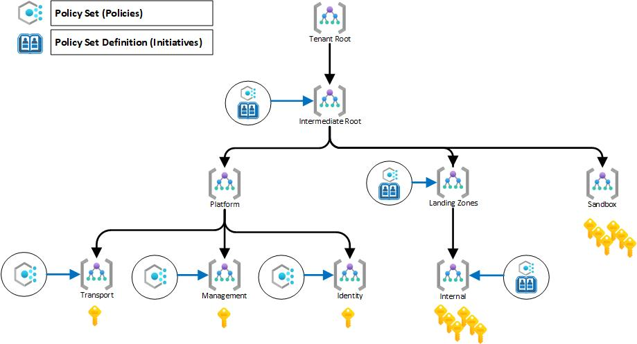

# Enclave Deployment: SCCA Compliant Hub and 3-Spoke Landing Zone with an Azure Kubernetes Service (AKS) Workload

## Overview

This enclave module deploys Platform Hub - 3 Spoke landing zone with a Azure Kubernetes Service workload.

> **NOTE**
>
> Prior to deploying an enclave, you must first deploy management groups, policies, and roles. Please review the Pre-requisites for more information.

Read on to understand what this enclave does, and when you're ready, collect all of the pre-requisites, then deploy the enclave.

## Architecture

 

## About

Enclaves are the preferred method for deployment using the NoOps Accelerator.  Enclaves will deploy onto your existing management groups, roles, and policies.  They automatically deploy your operations, logging, monitoring, and workloads from a single command.

Read more about a [Hub-spoke network topology in Azure](<https://learn.microsoft.com/en-us/azure/architecture/reference-architectures/hybrid-networking/hub-spoke?tabs=cli>).  Additional documentation about [Azure Kubernetes Service (AKS)](https://docs.microsoft.com/en-us/azure/aks/) can be found on Microsoft Learn.

This enclave uses the [Azure Kubernetes Service - Cluster workload](../../../bicep/workloads/wl-aks-spoke/readme.md) to deploy resources into a [Platform Hub 3 Spoke Network](../../../bicep/platforms/lz-platform-scca-hub-3spoke/readme.md).

## Pre-Requisites

### Subscriptions
---
Most customers will deploy each tier to a separate Azure subscription; however, multiple subscriptions are not required. A single subscription deployment can be used for testing and evaluation, or possibly a small I.T. administration team.

### Operational Network Artifacts
---
If needed, The Operational Network Artifacts are used when operations want to separate all keys, secrets and operations storage from the hub/spoke model.  An Azure Key Vault is created in a resource group in the Hub.  If Bastion is deployed, then the credentials to access bastion are automatically secured in key vault.

### Management Groups
---
The Enclave Management Groups overlay module deploys a management group hierarchy in a tenant under the `Tenant Root Group`.  This is accomplished through a tenant-scoped Azure Resource Manager (ARM) deployment.  The hierarchy  can be modified by editing [Azure Parameters template located in "management-groups/parameters" folder](../../overlays/management-groups/parameters/deploy.parameters.json).

Azure NoOps Accelerator recommends the following Management Group structure. This structure can be customized based on your organization's requirements.

* Workloads will be split by 2 groups of archetypes (INTERNAL, PARTNERS).

* The Sandbox management group is used for any new subscriptions that will be created. This will remove the subscription sprawl from the Root Tenant Group and will pull all subscriptions into security compliance.

The hierarchy created by the deployment ([Azure Parameters template located in "management-groups/parameters" folder](../../overlays/management-groups/parameters/deploy.parameters.json)) is:


> **NOTE**
>
> A management group structure can be deployed or modified through [Azure Bicep template located in "management-groups" folder](../../overlays/management-groups).  See [overlays/management-groups/readme.md](../../../overlays/management-groups/readme.md) to update parameters


**Overlay Example: Management Groups**

<details>

<summary>via Bash</summary>

```bash
# Set the active cloud.  Use az cloud list for a list of cloud names.
az cloud set --name 'AzureCloud'

# Set a subscription to be the current active subscription
subscriptionId="[your platform management subscription ID]"
az account set --subscription $subscriptionId

# Log in to Azure.
# By default, this command logs in with a user account. CLI will try to launch a web browser to log in interactively. If a web browser is not available, CLI will fall back to device code login. To login with a service principal, specify --service-principal.
az login

# Capture your Tenant ID
tenantId=$(az account show --query 'tenantId' --output tsv)

# Navigate to the Management Groups structure
cd src/bicep/overlays/management-groups

# Deploy Management Groups
az deployment mg create
--name 'deploy-enclave-mg'
--template-file 'deploy.bicep'
--parameters '@parameters/deploy.parameters.json' 
--management-group-id $tenantId
--location 'eastus'
--only-show-errors
```
</details>
</p>

<details>

<summary>via Azure CLI (AZ CLI)</summary>

```powershell
# Set the active cloud.  Use az cloud list for a list of cloud names.
az cloud set --name 'AzureCloud'

# Set a subscription to be the current active subscription
$subscriptionId="[your platform management subscription ID]"
az account set --subscription $subscriptionId

# Log in to Azure.
# By default, this command logs in with a user account. CLI will try to launch a web browser to log in interactively. If a web browser is not available, CLI will fall back to device code login. To login with a service principal, specify --service-principal.
az login

# Capture your Tenant ID
$tenantId=$(az account show --query 'tenantId' --output tsv)

# Navigate to the Management Groups structure
cd src/bicep/overlays/management-groups

# Deploy Management Groups
az deployment mg create
--name 'deploy-enclave-mg'
--template-file 'deploy.bicep'
--parameters '@parameters/deploy.parameters.json' 
--management-group-id $tenantId
--location 'eastus'
--only-show-errors
```
</details>
</p>

### Policy

[Azure Policy](https://docs.microsoft.com/azure/governance/policy/overview) is used to deploy guardrails for your environment. Azure Policy supports organizational standards enforcement and at-scale compliance evaluation.

Implementing governance for resource consistency, legal compliance, security, cost, and management are common use cases for Azure Policy. To assist you in getting started, your Azure environment already has built-in policy definitions for these typical use cases.

A collection of built-in Azure Policy Sets based on Regulatory Compliance are configured with Azure NoOps Accelerator. To boost compliance for logging, networking, and tagging requirements, custom policy sets have been developed. Through automation, these can be further expanded or eliminated as needed by the department.

The NoOps Accelerator includes the following deployable policies found in the [policy](../../overlays/Policy) folder:

  1. DoD IL/4

  1. DoD IL/5

  1. FedRAMP - Moderate Impact Level

  1. NIST 800-53A Rev. 4

  1. NIST 800-53A Rev. 5

> **NOTE**
>
> Policy structure can be deployed or modified through [Azure Bicep template located in "policy" folder](../../overlays/policy)  

  

**Overlay Example: Policies**

<details>

<summary>via Bash</summary>

```bash
# Set the active cloud.  Use az cloud list for a list of cloud names.
az cloud set --name 'AzureCloud'

# Set a subscription to be the current active subscription
subscriptionId="[your platform management subscription ID]"
az account set --subscription $subscriptionId

# Log in to Azure.
# By default, this command logs in with a user account. CLI will try to launch a web browser to log in interactively. If a web browser is not available, CLI will fall back to device code login. To login with a service principal, specify --service-principal.
az login

# Capture your Tenant ID
tenantId=$(az account show --query 'tenantId' --output tsv)

# Navigate to the Policy structure
cd src/bicep/overlays/Policy/builtin/assignments

# Deploy Policy (example using DoD IL/5 for GOVERNMENT deployment)
az deployment mg create
--name 'deploy-policy-dodil5'
--template-file 'policy-dodil5.bicep'
--parameters 'policy-dodil5.parameters.json'
--management-group-id 'ANOA'  # or the name of your INTERMEDIATE MANAGEMENT GROUP
--location 'usgovvirginia'
--only-show-errors
```

</details>
<p>

<details>

<summary>via Azure CLI (AZ CLI)</summary>

```bash
# Set the active cloud.  Use az cloud list for a list of cloud names.
az cloud set --name 'AzureCloud'

# Set a subscription to be the current active subscription
$subscriptionId="[your platform management subscription ID]"
az account set --subscription $subscriptionId

# Log in to Azure.
# By default, this command logs in with a user account. CLI will try to launch a web browser to log in interactively. If a web browser is not available, CLI will fall back to device code login. To login with a service principal, specify --service-principal.
az login

# Capture your Tenant ID
$tenantId=$(az account show --query 'tenantId' --output tsv)

# Navigate to the Policy structure
cd src/bicep/overlays/Policy/builtin/assignments

# Deploy Policy (example using NIST 800-53A R5 for COMMERCIAL deployment)
az deployment mg create
--name 'deploy-policy-nist80053r5'
--template-file 'policy-nist80053r5.bicep'
--parameters 'policy-nist80053r5.parameters.json'
--management-group-id 'ANOA'  # or the name of your INTERMEDIATE MANAGEMENT GROUP
--location 'usgovvirginia'
--only-show-errors
```

</details>
<p>

### Roles (RBAC)

The roles overlay module deploys a role definition in a specific `Management Group`.  This is accomplished through a managmenent-group-scoped Azure Resource Manager (ARM) deployment.  The role definitions heirarchy can be modifed by editing ([Azure Parameters template located in "roles/parameters" folder](../../overlays/roles/parameters/deploy.parameters.json)).  

Module deploys the following resources:

* Enclave Roles Definitions

The definitions created by the deployment is:

* Custom - VM Operator

* Custom - Network Operations (NetOps)

* Custom - Security Operations (SecOps)

* Custom - Landing Zone Application Owner

* Custom - Landing Zone Subscription Owner

* Custom - Storage Operator

Azure NoOps Accelerator assumes that Azure Active Directory has been provisioned and configured based on organization's requirements. It is important to check the following configuration for Azure Active Directory:

* License - Consider Azure PD Premium P2

* Multi-Factor Authentication - Enabled for all users

* Conditional Access Policies - Configured based on location & devices

* Privileged Identity Management (PIM) - Enabled for elevated access control.

* App Registration - Consider disabling for all users and created on-demand by CloudOps teams.

* Sign-In Logs - Logs are exported to Log Analytics workspace & Microsoft Sentinel used for threat hunting (Security Monitoring Team).

* Break-glass procedure - Process documented and implemented including 2 break glass accounts with different MFA devices & split up passwords.

* Azure Directory to Azure Active Directory synchronization - Are the identities synchronized or using cloud only account?
  
> **NOTE**
>
> Roles structure can be deployed or modified through [Azure Bicep template located in "roles" folder](../../overlays/roles/)

**Overlay Example: Roles**

<details>

<summary>via Bash</summary>

```bash
# Set the active cloud.  Use az cloud list for a list of cloud names.
az cloud set --name 'AzureCloud'

# Set a subscription to be the current active subscription
subscriptionId="[your platform management subscription ID]"
az account set --subscription $subscriptionId

# Log in to Azure.
# By default, this command logs in with a user account. CLI will try to launch a web browser to log in interactively. If a web browser is not available, CLI will fall back to device code login. To login with a service principal, specify --service-principal.
az login

# Capture your Tenant ID
tenantId=$(az account show --query 'tenantId' --output tsv)

# Navigate to the Roles structure
cd src/bicep/overlays/roles

# Deploy Roles
az deployment mg create
--name 'deploy-enclave-roles'
--template-file 'deploy.bicep'
--parameters '@parameters/deploy.parameters.all.json'
--management-group-id 'ANOA' # or the name of your INTERMEDIATE MANAGEMENT GROUP
--location 'eastus' --only-show-errors
```
</details>
<p>

<details>

<summary>via Powershell</summary>

```powershell
# Set the active cloud.  Use az cloud list for a list of cloud names.
az cloud set --name 'AzureCloud'

# Set a subscription to be the current active subscription
$subscriptionId="[your platform management subscription ID]"
az account set --subscription $subscriptionId

# Log in to Azure.
# By default, this command logs in with a user account. CLI will try to launch a web browser to log in interactively. If a web browser is not available, CLI will fall back to device code login. To login with a service principal, specify --service-principal.
az login

# Capture your Tenant ID
$tenantId=$(az account show --query 'tenantId' --output tsv)

# Navigate to the Roles structure
cd src/bicep/overlays/roles

# Deploy Roles
az deployment mg create
--name 'deploy-enclave-roles'
--template-file 'deploy.bicep'
--parameters '@parameters/deploy.parameters.all.json'
--management-group-id 'ANOA' # or the name of your INTERMEDIATE MANAGEMENT GROUP
--location 'eastus' --only-show-errors
```
</details>
<p>

## Parameters

See below for information on how to use the appropriate deployment parameters for use with this enclave:

Required Parameters | Type | Allowed Values | Description
| :-- | :-- | :-- | :-- |
parRequired | object | {object} | Required values used with all resources.
parTags | object | {object} | Required tags values used with all resources.
parLocation | string | `[deployment().location]` | The region to deploy resources into. It defaults to the deployment location.
parHub | object | {object} | Hub Virtual network configuration. See [azresources/hub-spoke-core/vdss/hub/readme.md](../../azresources/hub-spoke-core/vdss/hub/readme.md)
parOperationsSpoke | object | {object} | Operations Spoke Virtual network configuration. See [See azresources/hub-spoke-core/vdms/operations/readme.md](../../azresources/hub-spoke-core/vdms/operations/readme.md)
parAzureFirewall | object | {object} | Azure Firewall configuration. Azure Firewall is deployed in Forced Tunneling mode where a route table must be added as the next hop.
parLogging | object | {object} | Enables logging parameters and Microsoft Sentinel within the Log Analytics Workspace created in this deployment.
parRemoteAccess | object | {object} | When set too "true", provisions Azure Bastion Host. It defaults to "false".
parWorkload | object | {object} | Required values used for workloads.
parHubSubscriptionId | string | `xxxxxxx-xxxx-xxxx-xxxx-xxxxxxxx` | The subscription ID for the Hub Network.
parHubResourceGroupName | string | `anoa-eastus-platforms-hub-rg` | The resource group name for the Hub Network.
parHubVirtualNetworkName | string | `anoa-eastus-platforms-hub-vnet` | The virtual network name for the Hub Network.
parHubVirtualNetworkResourceId | string | `/subscriptions/xxxxxxxx-xxxxxx-xxxxx-xxxxxx-xxxxxx/resourceGroups/anoa-eastus-platforms-hub-rg/providers/Microsoft.Network/virtualNetworks/anoa-eastus-platforms-hub-vnet/subnets/anoa-eastus-platforms-hub-vnet` | The resource ID of the virtual network for the Hub Network.
parHubFirewallPolicyName | string | `anoa-eastus-dev-hub-afwp` | The name of the Firewall Policy in the Hub Virtual Network that hosts rules for Hub Subnet traffic
parFirewallPrivateIPAddress | string | `10.0.100.4` | The private ip address of the Firewall in the Hub Virtual Network.
parLogAnalyticsWorkspaceResourceId | string | `/subscriptions/xxxxxxxx-xxxxxx-xxxxx-xxxxxx-xxxxxx/resourcegroups/anoa-eastus-dev-logging-rg/providers/microsoft.operationalinsights/workspaces/anoa-eastus-dev-logging-log` | Log Analytics Workspace Resource Id.
parLogAnalyticsWorkspaceId | string | `anoa-eastus-dev-logging-log` | Log Analytics Workspace Resource Id
parSourceAddresses | array | `10.0.100.4` | Log Analytics Workspace Resource Id
parKubernetesCluster | object | {object} | The object parameters of the Azure Kubernetes Cluster. Found at [Azure Kubernetes Cluster](../../../bicep/overlays/management-services/kubernetesCluster/readme.md)
parContainerRegistry | object | {object} | The object parameters of the Container Registry. Found at [Azure Container Registry](../../../bicep/overlays/management-services/containerRegistry/readme.md)
parStorageAccountAccess | object | {object} | Defines the Storage Account Access.

Optional Parameters | Type | Allowed Values | Description
| :-- | :-- | :-- | :-- |
parNetworkArtifacts | object | {object} | Optional. Enables Operations Network Artifacts Resource Group with KV and Storage account for the ops subscriptions used in the deployment.
parSecurityCenter | object | {object} | Microsoft Defender for Cloud.  It includes email and phone.
parDdosStandard | bool | `false` | DDOS Standard configuration.

## Deploying the Enclave

Connect to the appropriate Azure Environment and set appropriate context, see getting started with Azure PowerShell or Azure CLI for help if needed. The commands below assume you are deploying in Azure Commercial and show the entire process of deploying enclave.

For example, deploying using the `az deployment sub create` command in the Azure CLI:

> **NOTE**:
>
> The output of bicep build may yield a .json file that is greater than 4Mb which is the limit for the maximum file size bicep can process.   Employ the following commands to remove space from the .json file:
>
>    **PowerShell**
>    ```powershell
>    # Remove the file if it exists
>    Remove-Item -Path .\DeployCompressed.json -Force
>
>    # Build the deploy.bicep into deploy.json
>    az bicep build --file '.\deploy.bicep'
>
>    # Remove excess space
>    Get-Content .\deploy.json | ConvertFrom-Json | ConvertTo-Json -Depth 100 -Compress | Out-File .\DeployCompressed.json
>    ```

**BASH**
```bash
# Set the active cloud.  Use az cloud list for a list of cloud names.
az cloud set --name 'AzureCloud'

# Set a subscription to be the current active subscription
subscriptionId="[your platform management subscription ID]"
az account set --subscription $subscriptionId

# Log in to Azure.
# By default, this command logs in with a user account. CLI will try to launch a web browser to log in interactively. If a web browser is not available, CLI will fall back to device code login. To login with a service principal, specify --service-principal.
az login

# Capture your Tenant ID
tenantId=$(az account show --query 'tenantId' --output tsv)

# Navigate to the Enclaves structure
cd src/bicep/enclaves/enclave-scca-hub3spoke-aks

# Deploy an Enclave
az deployment sub create
--name 'deploy-scca-enclave-with-aks'
--template-file 'DeployCompressed.json'
--parameters '@parameters/deploy.parameters.json'
--location 'eastus'
--subscription $subscriptionId
--only-show-errors
```

**PowerShell**
```powershell
# Set the active cloud.  Use az cloud list for a list of cloud names.
az cloud set --name 'AzureCloud'

# Set a subscription to be the current active subscription
$subscriptionId="[your platform management subscription ID]"
az account set --subscription $subscriptionId

# Log in to Azure.
# By default, this command logs in with a user account. CLI will try to launch a web browser to log in interactively. If a web browser is not available, CLI will fall back to device code login. To login with a service principal, specify --service-principal.
az login

# Capture your Tenant ID
$tenantId=$(az account show --query 'tenantId' --output tsv)

# Navigate to the Enclaves structure
cd src/bicep/enclaves/enclave-scca-hub3spoke-aks

# Deploy an Enclave
az deployment sub create
--name 'deploy-scca-enclave-with-aks'
--template-file 'DeployCompressed.json'
--parameters '@parameters/deploy.parameters.json'
--location 'eastus'
--subscription $subscriptionId
--only-show-errors
```

## Air-Gapped Clouds

For air-gapped clouds it may be convenient to transfer and deploy the compiled ARM template instead of the Bicep template if the Bicep CLI tools are not available or if it is desirable to transfer only one file into the air gap.

Use the **az bicep build** command to compile your .bicep files to a .json file.

## Validate the Deployment

Use the Azure portal, Azure CLI, or Azure PowerShell to list the deployed resources in the resource group.  Configure the default group using:

**AZ CLI**
```bash
az configure --defaults group=anoa-eastus-dev-aks-rg
```

```bash
az resource list --location 'eastus' --subscription 'xxxxxx-xxxx-xxxx-xxxx-xxxxxxxx' --resource-group 'anoa-eastus-dev-aks-rg'
```

**PowerShell**
```powershell
Get-AzResource -ResourceGroupName anoa-eastus-dev-aks-rg
```