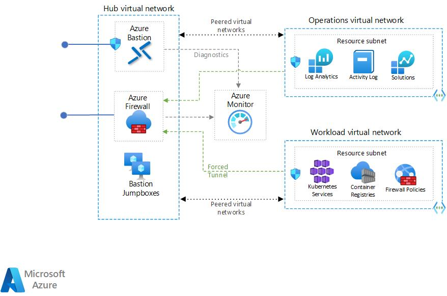

# NoOps Accelerator - Enclave - SCCA Compliant Hub - 1 Spoke landing zone with a Azure Kubernetes Service workload

## Overview

This enclave module deploys Platform Hub - 1 Spoke landing zone with a Azure Kubernetes Service workload.

> NOTE: When deploying enclaves; Management Groups, Policy and Roles need to be deployed first. Please review the Pre-requisites for more information.

Read on to understand what this enclave does, and when you're ready, collect all of the pre-requisites, then deploy the enclave.

## Architecture

 

## About Hub 1 Spoke Landing Zone with Azure Kubernetes Service - Private Cluster Workload

The docs on Hub/Spoke Landing Zone: <https://learn.microsoft.com/en-us/azure/architecture/reference-architectures/hybrid-networking/hub-spoke?tabs=cli>.

The docs on Azure Kubernetes Service: <https://docs.microsoft.com/en-us/azure/aks/>.

This Enclave uses the [Azure Kubernetes Service - Cluster workload](../../../bicep/workloads/wl-aks-spoke/readme.md) to deploy resources into [Platform Hub 1 Spoke Network](../../../bicep/platforms/lz-platform-scca-hub-1spoke/readme.md).

## Pre-requisites

### Subscriptions

Most customers will deploy each tier to a separate Azure subscription, but multiple subscriptions are not required. A single subscription deployment is good for a testing and evaluation, or possibly a small IT Admin team.

### Operational Network Artifacts

If needed, The Operational Network Artifacts are used when operations wants to seperate all key, secrets and operations storage from the hub/spoke model.

### Management Groups

The Enclave Management Groups ovlerlay module deploys a management group hierarchy in a tenant under the `Tenant Root Group`.  This is accomplished through a tenant-scoped Azure Resource Manager (ARM) deployment.  The heirarchy can be modifed by editing [Azure Parameters template located in "management-groups/parameters" folder](../../overlays/management-groups/parameters/deploy.parameters.json).

Azure NoOps Accelerator recommends the following Management Group structure. This structure can be customized based on your organization's requirements.

* Workloads will be split by 2 groups of archtypes (INTERNAL, PARTNERS).
* Sandbox management group is used for any new subscriptions that will be created. This will remove the subscription sprawl from the Root Tenant Group and will pull all subscriptions into the security compliance.

The hierarchy created by the deployment ([Azure Parameters template located in "management-groups/parameters" folder](../../overlays/management-groups/parameters/deploy.parameters.json)) is:


>NOTE: Management Group structure can be deployed or modified through [Azure Bicep template located in "management-groups" folder](../../overlays/management-groups).  See [overlays/management-groups/readme.md](../../../overlays/management-groups/readme.md) to update parameters

<h3>Overlay Example: Management Groups</h3>

<details>

<summary>via Bash</summary>

```bash
# For Azure Commerical regions

#sign  into AZ CLI, this will redirect you to a web browser for authentication, if required
az login
cd src/bicep/overlays
cd management-groups
az deployment mg create \
   --template-file overlays/management-groups/deploy.bicep \
   --parameters @overlays/management-groups/deploy.enclave.mg.parameters.json \
   --location 'eastus'
```

```bash
# For Azure Government regions

# change Azure Clouds
az cloud set --name AzureUSGovernment

#sign  into AZ CLI, this will redirect you to a web browser for authentication, if required
az login
cd src/bicep/overlays
cd management-groups
az deployment mg create \
  --template-file overlays/management-groups/deploy.bicep \
  --parameters @overlays/management-groups/deploy.enclave.mg.parameters.json \
  --location 'usgovvirginia'
```

</details>
<p>

<details>

<summary>via Powershell</summary>

```powershell
# For Azure Commerical regions

#sign in to Azure  from Powershell, this will redirect you to a web browser for authentication, if required
Connect-AzAccount

#Fetch the list of available Tenant Ids.
Get-AzTenant

#Grab the tenant Id Switch to another active directory tenant.
Set-AzContext -TenantId XXXXXXXX-XXXX-XXXX-XXXX-XXXXXXXXXXXX

New-AzManagementGroupDeployment `
  -ManagementGroupId xxxxxxx-xxxx-xxxxxx-xxxxx-xxxx
  -TemplateFile overlays/management-groups/deploy.bicepp `
  -TemplateParameterFile overlays/management-groups/deploy.enclave.mg.parameters.json `
  -Location 'eastus'
```

OR

```powershell
# For Azure Government regions

#sign in to Azure  from Powershell, this will redirect you to a web browser for authentication, if required
Connect-AzAccount

#Fetch the list of available Tenant Ids.
Get-AzTenant

#Grab the tenant Id Switch to another active directory tenant.
Set-AzContext -TenantId XXXXXXXX-XXXX-XXXX-XXXX-XXXXXXXXXXXX

New-AzManagementGroupDeployment `
  -ManagementGroupId xxxxxxx-xxxx-xxxxxx-xxxxx-xxxx
  -TemplateFile overlays/management-groups/deploy.bicepp `
  -TemplateParameterFile overlays/management-groups/deploy.enclave.mg.parameters.json.json `
  -Location  'usgovvirginia'
```
</details>
<p>

### Policy - Security Controls

[Azure Policy](https://docs.microsoft.com/azure/governance/policy/overview) is used to deploy guardrails for your environment. Azure Policy supports organizational standards enforcement and at-scale compliance evaluation.

Implementing governance for resource consistency, legal compliance, security, cost, and management are common use cases for Azure Policy. To assist you in getting started, your Azure environment already has built-in policy definitions for these typical use cases.

A collection of built-in Azure Policy Sets based on Regulatory Compliance are configured with Azure NoOps Accelerator. To boost compliance for logging, networking, and tagging requirements, custom policy sets have been developed. Through automation, these can be further expanded or eliminated as needed by the department.

> Policy structure can be deployed or modified through [Azure Bicep template located in "policy" folder](../../overlays/policy)


<h3>Overlay Example: Policies</h3>

<details>

<summary>via Bash</summary>

```bash
# For Azure Commerical regions
az login
cd src/bicep/overlays
cd policy
az deployment mg create \
   --template-file overlays/policy/deploy.bicep \
   --parameters @overlays/policy/deploy.enclave.policy.parameters.json \
   --location 'eastus'
```

```bash
# For Azure Government regions
az deployment mg create \
  --template-file overlays/policy/deploy.bicep \
  --parameters @overlays/policy/deploy.enclave.policy.parameters.json \
  --location 'usgovvirginia'
```

</details>
<p>

<details>

<summary>via Powershell</summary>

```powershell
# For Azure Commerical regions

#sign in to Azure  from Powershell, this will redirect you to a web browser for authentication, if required
Connect-AzAccount

#Fetch the list of available Tenant Ids.
Get-AzTenant

#Grab the tenant Id Switch to another active directory tenant.
Set-AzContext -TenantId XXXXXXXX-XXXX-XXXX-XXXX-XXXXXXXXXXXX

New-AzManagementGroupDeployment `
  -ManagementGroupId xxxxxxx-xxxx-xxxxxx-xxxxx-xxxx
  -TemplateFile overlays/policy/deploy.bicep `
  -TemplateParameterFile overlays/policy/deploy.enclave.policy.parameters.json `
  -Location 'eastus'
```

OR

```powershell
# For Azure Government regions

#sign in to Azure  from Powershell, this will redirect you to a web browser for authentication, if required
Connect-AzAccount

#Fetch the list of available Tenant Ids.
Get-AzTenant

#Grab the tenant Id Switch to another active directory tenant.
Set-AzContext -TenantId XXXXXXXX-XXXX-XXXX-XXXX-XXXXXXXXXXXX

New-AzManagementGroupDeployment `
  -ManagementGroupId xxxxxxx-xxxx-xxxxxx-xxxxx-xxxx
  -TemplateFile overlays/policy/deploy.bicep `
  -TemplateParameterFile overlays/policy/deploy.enclave.policy.parameters.json.json `
  -Location  'usgovvirginia'
```
</details>
<p>

### RBAC - Roles

The Enclave Roles overlay module deploys a role definitions in a specific `Management Group`.  This is accomplished through a managmenent-group-scoped Azure Resource Manager (ARM) deployment.  The role definitions heirarchy can be modifed by editing ([Azure Parameters template located in "roles/parameters" folder](../../overlays/roles/parameters/deploy.parameters.json)).  

Module deploys the following resources:

* Enclave Roles Definitions

The definitions created by the deployment is:

* Custom - VM Operator
* Custom - Network Operations (NetOps)
* Custom - Security Operations (SecOps)
* Custom - Landing Zone Application Owner
* Custom - Landing Zone Subscription Owner
* Custom - Storage Operator

Azure NoOps Accelerator assumes that Azure Active Directory has been provisioned and configured based on organization's requirements. It is important to check the following configuration for Azure Active Directory:

* License - Consider Azure PD Premium P2
* Multi-Factor Authentication - Enabled for all users
* Conditional Access Policies - Configured based on location & devices
* Privileged Identity Management (PIM) - Enabled for elevated access control.
* App Registration - Consider disabling for all users and created on-demand by CloudOps teams.
* Sign-In Logs - Logs are exported to Log Analytics workspace & Microsoft Sentinel used for threat hunting (Security Monitoring Team).
* Break-glass procedure - Process documented and implemented including 2 break glass accounts with different MFA devices & split up passwords.
* Azure Directory to Azure Active Directory synchronization - Are the identities synchronized or using cloud only account?
  
> Roles structure can be deployed or modified through [Azure Bicep template located in "roles" folder](../../overlays/roles/)

<h3>Overlay Example: Roles</h3>

<details>

<summary>via Bash</summary>

```bash
# For Azure Commerical regions

#sign  into AZ CLI, this will redirect you to a web browser for authentication, if required
az login
cd src/bicep/overlays
cd roles
az deployment mg create \
   --template-file overlays/roles/deploy.bicep \
   --parameters @overlays/roles/deploy.enclave.roles.parameters.json \
   --location 'eastus'
```

```bash
# For Azure Government regions

# change Azure Clouds
az cloud set --name AzureUSGovernment

#sign  into AZ CLI, this will redirect you to a web browser for authentication, if required
az login
cd src/bicep/overlays
cd roles
az deployment mg create \
  --template-file overlays/roles/deploy.bicep \
  --parameters @overlays/roles/deploy.enclave.roles.parameters.json \
  --location 'usgovvirginia'
```

</details>
<p>

<details>

<summary>via Powershell</summary>

```powershell
# For Azure Commerical regions

#sign in to Azure  from Powershell, this will redirect you to a web browser for authentication, if required
Connect-AzAccount

#Fetch the list of available Tenant Ids.
Get-AzTenant

#Grab the tenant Id Switch to another active directory tenant.
Set-AzContext -TenantId XXXXXXXX-XXXX-XXXX-XXXX-XXXXXXXXXXXX

New-AzManagementGroupDeployment `
  -ManagementGroupId xxxxxxx-xxxx-xxxxxx-xxxxx-xxxx
  -TemplateFile overlays/roles/deploy.bicepp `
  -TemplateParameterFile overlays/roles/deploy.enclave.roles.parameters.json `
  -Location 'eastus'
```

OR

```powershell
# For Azure Government regions

#sign in to Azure  from Powershell, this will redirect you to a web browser for authentication, if required
Connect-AzAccount

#Fetch the list of available Tenant Ids.
Get-AzTenant

#Grab the tenant Id Switch to another active directory tenant.
Set-AzContext -TenantId XXXXXXXX-XXXX-XXXX-XXXX-XXXXXXXXXXXX

New-AzManagementGroupDeployment `
  -ManagementGroupId xxxxxxx-xxxx-xxxxxx-xxxxx-xxxx
  -TemplateFile overlays/roles/deploy.bicepp `
  -TemplateParameterFile overlays/roles/deploy.enclave.roles.parameters.json `
  -Location  'usgovvirginia'
```
</details>
<p>

## Parameters

See below for information on how to use the appropriate deployment parameters for use with this enclave:

Required Parameters | Type | Allowed Values | Description
| :-- | :-- | :-- | :-- |
parRequired | object | {object} | Required values used with all resources.
parTags | object | {object} | Required tags values used with all resources.
parLocation | string | `[deployment().location]` | The region to deploy resources into. It defaults to the deployment location.
parHub | object | {object} | Hub Virtual network configuration. See [azresources/hub-spoke-core/vdss/hub/readme.md](../../azresources/hub-spoke-core/vdss/hub/readme.md)
parOperationsSpoke | object | {object} | Operations Spoke Virtual network configuration. See [See azresources/hub-spoke-core/vdms/operations/readme.md](../../azresources/hub-spoke-core/vdms/operations/readme.md)
parAzureFirewall | object | {object} | Azure Firewall configuration. Azure Firewall is deployed in Forced Tunneling mode where a route table must be added as the next hop.
parLogging | object | {object} | Enables logging parmeters and Microsoft Sentinel within the Log Analytics Workspace created in this deployment.
parRemoteAccess | object | {object} | When set to "true", provisions Azure Bastion Host. It defaults to "false".

Optional Parameters | Type | Allowed Values | Description
| :-- | :-- | :-- | :-- |
parNetworkArtifacts | object | {object} | Optional. Enables Operations Network Artifacts Resource Group with KV and Storage account for the ops subscriptions used in the deployment.
parSecurityCenter | object | {object} | Microsoft Defender for Cloud.  It includes email and phone.
parDdosStandard | bool | `false` | DDOS Standard configuration.

## Deploy the Enclave

Connect to the appropriate Azure Environment and set appropriate context, see getting started with Azure PowerShell or Azure CLI for help if needed. The commands below assume you are deploying in Azure Commercial and show the entire process of deploying Encalve.

For example, deploying using the `az deployment sub create` command in the Azure CLI:

### Azure CLI

```bash
# For Azure Commerical regions
az login
cd src/bicep
cd platforms/lz-platform-scca-hub-3spoke
az deployment sub create \ 
--name contoso \
--subscription xxxxxx-xxxx-xxxx-xxxx-xxxxxxxxx \
--template-file platforms/lz-platform-scca-hub-3spoke/deploy.bicep \
--location eastus \
--parameters @platforms/lz-platform-scca-hub-3spoke/parameters/deploy.parameters.json
cd overlays
cd app-service-plan
az deployment sub create \
   --name deploy-AppServicePlan
   --template-file overlays/app-service-plan/deploy.bicep \
   --parameters @overlays/app-service-plan/parameters/deploy.parameters.json \
   --subscription xxxxxx-xxxx-xxxx-xxxx-xxxxxxxxx \
   --location 'eastus'
```

OR

```bash
# For Azure Government regions
az deployment sub create \
  --template-file overlays/app-service-plan/deploy.bicep \
  --parameters @overlays/app-service-plan/parameters/deploy.parameters.json \
  --subscription xxxxxx-xxxx-xxxx-xxxx-xxxxxxxxx \
  --resource-group anoa-usgovvirginia-platforms-hub-rg \
  --location 'usgovvirginia'
```

### PowerShell

```powershell
# For Azure Commerical regions
New-AzSubscriptionDeployment `
  -ManagementGroupId xxxxxxx-xxxx-xxxxxx-xxxxx-xxxx
  -TemplateFile overlays/app-service-plan/deploy.bicepp `
  -TemplateParameterFile overlays/app-service-plan/parameters/deploy.parameters.example.json `
  -Subscription xxxxxx-xxxx-xxxx-xxxx-xxxxxxxxx `
  -ResourceGroup anoa-eastus-platforms-hub-rg `
  -Location 'eastus'
```

OR

```powershell
# For Azure Government regions
New-AzSubscriptionDeployment `
  -ManagementGroupId xxxxxxx-xxxx-xxxxxx-xxxxx-xxxx
  -TemplateFile overlays/app-service-plan/deploy.bicepp `
  -TemplateParameterFile overlays/app-service-plan/parameters/deploy.parameters.example.json `
  -Subscription xxxxxx-xxxx-xxxx-xxxx-xxxxxxxxx `
  -ResourceGroup anoa-usgovvirginia-platforms-hub-rg `
  -Location  'usgovvirginia'
```

## Extending the Overlay

By default, this overlay has the minium parmeters needed to deploy the service. If you like to add addtional parmeters to the service, please refer to the module description located in AzResources here: [`App Service Plans `[Microsoft.Web/serverfarms]`](D:\source\repos\NoOpsAccelerator\src\bicep\azresources\Modules\Microsoft.Web\serverfarms\readme.md)

## Air-Gapped Clouds

For air-gapped clouds it may be convenient to transfer and deploy the compiled ARM template instead of the Bicep template if the Bicep CLI tools are not available or if it is desirable to transfer only one file into the air gap.

## Validate the deployment

Use the Azure portal, Azure CLI, or Azure PowerShell to list the deployed resources in the resource group.

Configure the default group using:

```bash
az configure --defaults group=anoa-eastus-dev-appplan-rg.
```

```bash
az resource list --location eastus --subscription xxxxxx-xxxx-xxxx-xxxx-xxxxxxxx --resource-group anoa-eastus-dev-appplan-rg
```

OR

```powershell
Get-AzResource -ResourceGroupName anoa-eastus-dev-appplan-rg
```

## Cleanup

The Bicep/ARM deployment of NoOps Accelerator - Azure App Service Plan deployment can be deleted with these steps:

### Delete Resource Groups

```bash
az group delete --name anoa-eastus-dev-appplan-rg
```

OR

```powershell
Remove-AzResourceGroup -Name anoa-eastus-dev-appplan-rg
```

### Delete Deployments

```bash
az deployment delete --name deploy-AppServicePlan
```

OR

```powershell
Remove-AzSubscriptionDeployment -Name deploy-AppServicePlan
```

## Example Output in Azure


### References