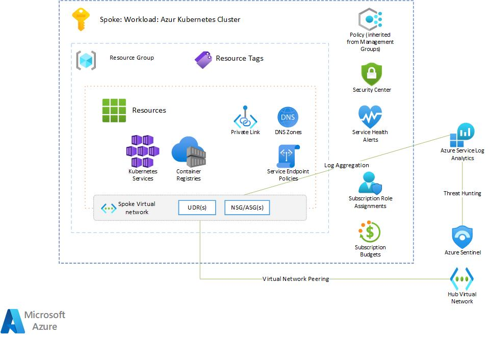

# Workloads: NoOps Accelerator - Tier 3 - Azure Kubernetes Service

## Navigation

- [Workloads: NoOps Accelerator - Tier 3 - Azure Kubernetes Service](#workloads-noops-accelerator---tier-3---azure-kubernetes-service)
  - [Navigation](#navigation)
  - [Overview](#overview)
  - [Architecture](#architecture)
  - [Pre-requisites](#pre-requisites)
  - [About Azure Container Registry](#about-azure-container-registry)
  - [About Azure Kubernetes Service - Cluster](#about-azure-kubernetes-service---cluster)
  - [Azure Kubernetes Service Workload Parameters](#azure-kubernetes-service-workload-parameters)
  - [Outputs](#outputs)
  - [References](#references)

## Overview

This workload module creates a Workload [Tier 3 Spoke Network](../tier3/README.md) deployment that deploys a Azure Kubernetes Service with RBAC enabled, if required. A Azure Kubernetes Service utilizes hardware security modules to protect key material. Roles for use must be assigned post-deployment, review reference list below for detailed information.

Read on to understand what this workload does, and when you're ready, collect all of the pre-requisites, then deploy the workload.

## Architecture

 

## Pre-requisites

* One or more Azure subscriptions where you or an identity you manage has Owner RBAC permissions

* For deployments in the Azure Portal you need access to the portal in the cloud you want to deploy to, such as <https://portal.azure.com> or <https://portal.azure.us>.

* For deployments in BASH or a Windows shell, then a terminal instance with the AZ CLI installed is required. For example, Azure Cloud Shell, the MLZ development container, or a command shell on your local machine with the AZ CLI installed.

* For PowerShell deployments you need a PowerShell terminal with the Azure Az PowerShell module installed.

>NOTE: The AZ CLI will automatically install the Bicep tools when a command is run that needs them, or you can manually install them following the instructions here.

## About Azure Container Registry

The docs on Azure Container Registry: <https://docs.microsoft.com/en-us/azure/container-registry/>. By default, this worload uses the Azure Container Registry overlay to deploy resources into [Tier 3 Spoke Network](../tier3/README.md).  

The subscription and resource group can be changed by providing the resource group name (Param: parTargetSubscriptionId/parTargetResourceGroup) and ensuring that the Azure context is set the proper subscription.  

## About Azure Kubernetes Service - Cluster

The docs on Azure Kubernetes Service: <https://docs.microsoft.com/en-us/azure/aks/>.  this worload uses the Azure Kubernetes Service - Cluster overlay to deploy resources into [Tier 3 Spoke Network](../tier3/README.md).  

The subscription and resource group can be changed by providing the resource group name (Param: parTargetSubscriptionId/parTargetResourceGroup) and ensuring that the Azure context is set the proper subscription.  

## Azure Kubernetes Service Workload Parameters

| Parameter | Type | Default | Description | Requirement | Example |
| --------- | ---- | ------- | ----------- | ----------- | ------- |
parOrgPrefix | string | none | The name of key vault.  If not specified, the name will default to the MLZ default naming pattern. | Yes |  |
parDeployEnvironment | string | none | The name of key vault.  If not specified, the name will default to the MLZ default naming pattern. | Yes |  |
parWorkloadSubscriptionId | string | none | The name of the SubscriptionId where the AKS will be deployed. If not specified, the SubscriptionId name will default to the shared services Hub/Spoke subscription. | Yes |  |
parWorkloadName | string | none | The name of key vault.  If not specified, the name will default to the MLZ default naming pattern. | Yes |  |
parTags | string | none | The name of key vault.  If not specified, the name will default to the MLZ default naming pattern. | Yes |  |
parHubSubscriptionId | string | none | The name of key vault.  If not specified, the name will default to the MLZ default naming pattern. | Yes |  |
parHubResourceGroupName | string | none | The name of key vault.  If not specified, the name will default to the MLZ default naming pattern. | Yes |  |
parHubVirtualNetworkName | string | none | The name of key vault.  If not specified, the name will default to the MLZ default naming pattern. | Yes |  |
parHubVirtualNetworkResourceId | string | none | The name of key vault.  If not specified, the name will default to the MLZ default naming pattern. | Yes |  |
parFirewallPrivateIPAddress | string | none | The name of key vault.  If not specified, the name will default to the MLZ default naming pattern. | Yes |  |
parLogAnalyticsWorkspaceResourceId | string | none | The name of key vault.  If not specified, the name will default to the MLZ default naming pattern. | Yes |  |
parLogAnalyticsWorkspaceName | string | none | The name of key vault.  If not specified, the name will default to the MLZ default naming pattern. | Yes |  |
parAksClusterKubernetesVersion | string | none | The name of key vault.  If not specified, the name will default to the MLZ default naming pattern. | Yes |  |
parAppGatewayResourceId | string | none | The name of key vault.  If not specified, the name will default to the MLZ default naming pattern. | Yes |  |
parIngressApplicationGatewayEnabled | string | none | The name of key vault.  If not specified, the name will default to the MLZ default naming pattern. | Yes |  |
parAksClusterDockerBridgeCidr | string | none | The name of key vault.  If not specified, the name will default to the MLZ default naming pattern. | Yes |  |
parAksClusterLoadBalancerSku | string | none | The name of key vault.  If not specified, the name will default to the MLZ default naming pattern. | Yes |  |
parEnablePrivateCluster | string | none | The name of key vault.  If not specified, the name will default to the MLZ default naming pattern. | Yes |  |
parEnableAzureDefender | string | none | The name of key vault.  If not specified, the name will default to the MLZ default naming pattern. | Yes |  |

## Outputs

| Output | Type
| ------ | ----
azureKeyVaultName | string |
resourceGroupName | string |
tags | object |

## References

* [Azure Kubernetes Service Documentation](https://docs.microsoft.com/en-us/azure/aks/)
* [Azure Kubernetes Service Overview](https://docs.microsoft.com/en-us/azure/aks/intro-kubernetes)
