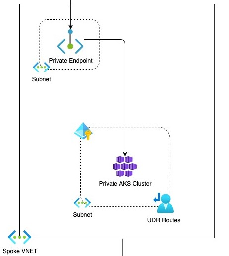

# NoOps Accelerator - Workloads - Tier 3 - Azure Kubernetes Service

## Authored & Tested With

* [azure-cli](https://docs.microsoft.com/en-us/cli/azure/install-azure-cli) version 2.38.0
* bicep cli version v0.9.1
* [bicep](https://marketplace.visualstudio.com/items?itemName=ms-azuretools.vscode-bicep) v0.9.1 vscode extension

## Navigation

* [Overview](#overview)
* [Architecture](#architecture)
* [Pre-requisites](#pre-requisites)
* [Deployment](#deployment)
* [Parameters](#add-on-parameters)
* [Outputs](#Outputs)
* [Resource Types](#Resource-Types)

## Overview

This workload module creates a Workload (Tier 3) deployment that deploys a Azure Kubernetes Service with RBAC enabled, if required. A Azure Kubernetes Service utilizes hardware security modules to protect key material. Roles for use must be assigned post-deployment, review reference list below for detailed information.

Read on to understand what this workload does, and when you're ready, collect all of the pre-requisites, then deploy the workload.

## Architecture

 

## Pre-requisites

* One or more Azure subscriptions where you or an identity you manage has Owner RBAC permissions

* For deployments in the Azure Portal you need access to the portal in the cloud you want to deploy to, such as <https://portal.azure.com> or <https://portal.azure.us>.

* For deployments in BASH or a Windows shell, then a terminal instance with the AZ CLI installed is required. For example, Azure Cloud Shell, the MLZ development container, or a command shell on your local machine with the AZ CLI installed.

* For PowerShell deployments you need a PowerShell terminal with the Azure Az PowerShell module installed.

>NOTE: The AZ CLI will automatically install the Bicep tools when a command is run that needs them, or you can manually install them following the instructions here.

## Deployment

The docs on Azure Kubernetes Service: <https://docs.microsoft.com/en-us/azure/key-vault/>.

This workload shows how to deploy using Bicep to support the deployment. By default, this template will deploy resources into standard default Hub/Spoke subscriptions and resource groups.

The subscription can be changed by providing the subscription Id (Param: parWorkloadSubscriptionId) and ensuring that the Azure context is set the proper subscription.

Connect to the appropriate Azure Environment and set appropriate context, see getting started with Azure PowerShell for help if needed. The commands below assume you are deploying in Azure Commercial or Azure Government and shows the entire process of deploying a Azure Kubernetes Service post-deployment of the Hub/Spoke Network.

```Azure CLI

```

## Azure Kubernetes Service Workload Parameters

| Parameter | Type | Default | Description | Requirement | Example |
| --------- | ---- | ------- | ----------- | ----------- | ------- |
parOrgPrefix | string | none | The name of key vault.  If not specified, the name will default to the MLZ default naming pattern. | Yes |  |
parDeployEnvironment | string | none | The name of key vault.  If not specified, the name will default to the MLZ default naming pattern. | Yes |  |
parWorkloadSubscriptionId | string | none | The name of the SubscriptionId where the AKS will be deployed. If not specified, the SubscriptionId name will default to the shared services Hub/Spoke subscription. | Yes |  |
parWorkloadName | string | none | The name of key vault.  If not specified, the name will default to the MLZ default naming pattern. | Yes |  |
parTags | string | none | The name of key vault.  If not specified, the name will default to the MLZ default naming pattern. | Yes |  |
parHubSubscriptionId | string | none | The name of key vault.  If not specified, the name will default to the MLZ default naming pattern. | Yes |  |
parHubResourceGroupName | string | none | The name of key vault.  If not specified, the name will default to the MLZ default naming pattern. | Yes |  |
parHubVirtualNetworkName | string | none | The name of key vault.  If not specified, the name will default to the MLZ default naming pattern. | Yes |  |
parHubVirtualNetworkResourceId | string | none | The name of key vault.  If not specified, the name will default to the MLZ default naming pattern. | Yes |  |
parFirewallPrivateIPAddress | string | none | The name of key vault.  If not specified, the name will default to the MLZ default naming pattern. | Yes |  |
parLogAnalyticsWorkspaceResourceId | string | none | The name of key vault.  If not specified, the name will default to the MLZ default naming pattern. | Yes |  |
parLogAnalyticsWorkspaceName | string | none | The name of key vault.  If not specified, the name will default to the MLZ default naming pattern. | Yes |  |
parAksClusterKubernetesVersion | string | none | The name of key vault.  If not specified, the name will default to the MLZ default naming pattern. | Yes |  |
parAppGatewayResourceId | string | none | The name of key vault.  If not specified, the name will default to the MLZ default naming pattern. | Yes |  |
parIngressApplicationGatewayEnabled | string | none | The name of key vault.  If not specified, the name will default to the MLZ default naming pattern. | Yes |  |
parAksClusterDockerBridgeCidr | string | none | The name of key vault.  If not specified, the name will default to the MLZ default naming pattern. | Yes |  |
parAksClusterLoadBalancerSku | string | none | The name of key vault.  If not specified, the name will default to the MLZ default naming pattern. | Yes |  |
parEnablePrivateCluster | string | none | The name of key vault.  If not specified, the name will default to the MLZ default naming pattern. | Yes |  |
parEnableAzureDefender | string | none | The name of key vault.  If not specified, the name will default to the MLZ default naming pattern. | Yes |  |

## Outputs

| Output | Type
| ------ | ----
azureKeyVaultName | string |
resourceGroupName | string |
tags | object |

## References

* [Azure Kubernetes Service Documentation](https://docs.microsoft.com/en-us/azure/aks/)
* [Azure Kubernetes Service Overview](https://docs.microsoft.com/en-us/azure/aks/intro-kubernetes)
